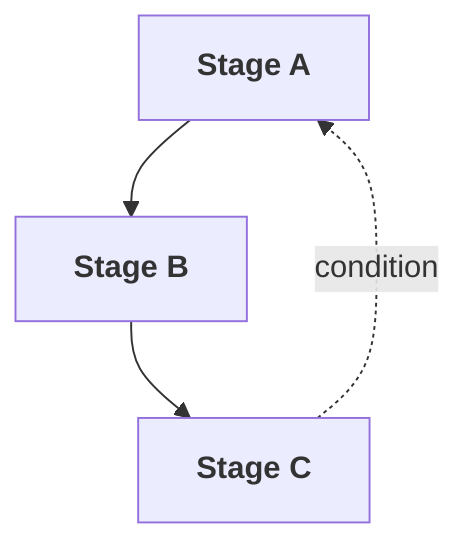

# Organize

Map the stages and flow of the framework.

## Inputs

| Input | Source |
|-------|--------|
| framework_charter | Frame stage output |
| reference_frameworks | Optional: existing frameworks for structural patterns |

### Input Format

**From Frame stage (`output/{date}/{name}-charter.md`):**

```markdown
# Framework Charter: {NAME}

## Problem
{Workflow being addressed}

## Purpose
{Why this framework exists}

## Scope
**In:** {What's covered}
**Out:** {What's excluded}

## Type
{Foundation / Pipeline / Cyclical / Hub}

## Dependencies
| Requires | From | Why |
```

**Optional reference frameworks:**

```yaml
reference_frameworks:
  - path: docs/models/[framework].md
```

## Process

**1. Identify Stages** - Break the workflow into distinct stages:
- What are the major phases of work?
- Each stage should have a clear purpose and output
- Aim for 3-7 stages (fewer for foundation frameworks)

**2. Name Stages** - Choose clear, action-oriented names:
- Verbs or nouns that describe what happens
- Consider acronym potential if desired
- Check for naming conflicts with existing skills

**3. Map Flow** - Determine how stages connect:
- Linear: A → B → C
- Branching: A → B or C based on condition
- Hub: Central stage others connect to
- Draw the flow as a mermaid diagram

**4. Define Dependencies** - What does this framework need from others:
- Which inputs come from other frameworks?
- At which stage are they needed?

**5. Identify Feedback Loops** - When to go backwards:
- What conditions cause a return to earlier stages?
- What triggers re-evaluation?

**6. Define Terminal States** - How does the framework end:
- Success state(s)
- Failure/exit states
- What actions accompany each?

## Output

Save to `output/{date}/` (same date as Frame).

| File | Content |
|------|---------|
| `run.md` | Append Organize decisions |
| `{name}-stage-map.md` | Stage map |

### Run Log (run.md) - Append

```markdown
---

## Organize - {date}

**Decisions:**
| Question | Choice |
|----------|--------|
| {question} | {selection} |

**Output:** `{name}-stage-map.md`
```

### Stage Map ({name}-stage-map.md)

```markdown
# Stage Map: {NAME}

## Stages

| Stage | Purpose | Inputs | Outputs |
|-------|---------|--------|---------|
| {Name} | {Brief description} | {What it needs} | {What it produces} |

## Flow



## Dependencies

| This Framework Needs | From | At Stage |
|----------------------|------|----------|
| {Input} | {Source} | {Which stage} |

## Feedback Loops

| From | Condition | To |
|------|-----------|-----|
| {Stage} | {When this happens} | {Return to} |

## Terminal States

| State | Definition | Actions |
|-------|------------|---------|
| {Name} | {Condition} | {What to do} |
```

## Quality Criteria

- [ ] Stages are distinct (no overlapping purposes)
- [ ] Each stage has clear inputs and outputs
- [ ] Flow diagram renders correctly
- [ ] Outputs from one stage feed inputs of next
- [ ] Feedback loops cover likely failure modes
- [ ] Terminal states are explicit

## Completion

Present: Stage map with flow diagram. Approve → Refine.
