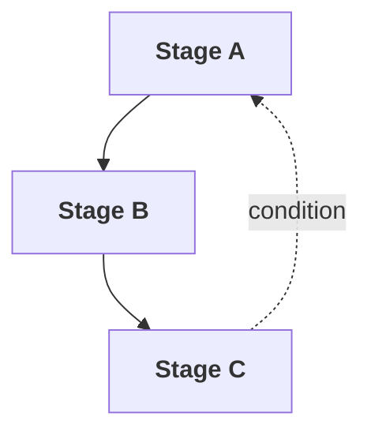

# Organize Template

Output templates for the Organize stage.

---

## Run Log (run.md) - Append

```markdown
---

## Organize - {date}

**Decisions:**
| Question | Choice |
|----------|--------|
| {question} | {selection} |

**Output:** `{model}-stage-map.md`
```

---

## Stage Map ({model}-stage-map.md)

```markdown
# Stage Map: {MODEL NAME}

## Stages

| Stage | Purpose | Inputs | Outputs |
|-------|---------|--------|---------|
| {Name} | {Brief description} | {What it needs} | {What it produces} |

## Flow



## Dependencies

| This Model Needs | From | At Stage |
|------------------|------|----------|
| {Input} | {Source model} | {Which stage} |

## Feedback Loops

| From | Condition | To |
|------|-----------|-----|
| {Stage} | {When this happens} | {Return to} |

## Terminal States

| State | Definition | Actions |
|-------|------------|---------|
| {Name} | {Condition} | {What to do} |
```
