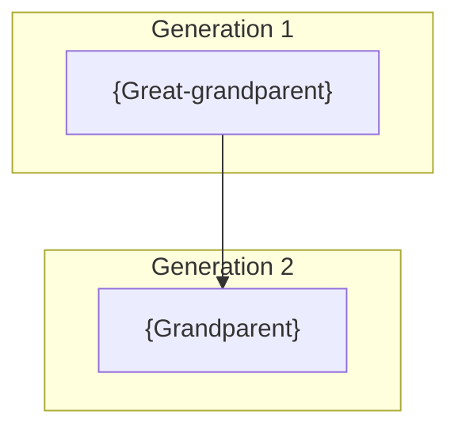

# Visualize

Generate tree views, identify gaps, and plan next capture sessions.

## Inputs

| Input | Source |
|-------|--------|
| family_tree | Integrate stage output |
| focus_person | Optional: user input for specific view |

### Input Format

**From Integrate stage (`output/{date}/family-tree.md`):**

```markdown
## People

### {ID}: {Full Name}
- Born: {date}, {place}
- Confidence: {level}

## Relationships

| Person A | Relationship | Person B | Confidence | Source |
```

**Optional focus person:**

```yaml
focus_person: {name or ID for centered view}
view_type: ancestor | descendant | full
```

## Process

**1. Generate Tree Diagram** - Create visual representation:
- Build mermaid flowchart from relationships
- Group by generation where possible
- Color-code by confidence if requested

**2. Calculate Statistics** - Summarize tree state:
- Total people and relationships
- Generation count
- Confidence distribution

**3. Identify Gaps** - Find missing information:
- People with no parents linked
- Unknown dates
- Single-source records
- Unconnected people
- Missing generations

**4. Prioritize Gaps** - Order by importance:
- High: Direct line ancestors, unconnected people
- Medium: Missing dates, generation gaps
- Low: Single-source corroboration

**5. Plan Next Steps** - Recommend actions:
- Who to interview next
- What to ask about
- What research to do

## Interaction

See CLAUDE.md "Interaction Protocol" for tool usage and menu format.

**Stage-specific triggers for `AskUserQuestion`:**
- View type selection (ancestor/descendant/full)
- Focus person for centered view
- Export format selection
- Gap priority confirmation

## Output

Save to `output/{date}/` (same date as Capture).

| File | Content |
|------|---------|
| `run.md` | Append Visualize entry and finalize |
| `visualization.md` | Tree diagram, stats, gaps |

### Run Log (run.md)

Append Visualize stage entry and finalize run.

```markdown
---

## Visualize - {date}

**View generated:** {type}
**Gaps identified:** {count}

**Output:** `visualization.md`

---

## Outcome

**Status:** complete
**Result:** ROOTS session complete with {n} people in tree
**Next session:** {recommended focus}
```

### Visualization (visualization.md)

```markdown
# Tree Visualization: {date}

## Statistics

| Metric | Value |
|--------|-------|
| Total people | {count} |
| Total relationships | {count} |
| Generations | {count} |
| Confidence: High | {count} () |
| Confidence: Low | {count} ({%}) |

---

## Tree Diagram



---

## Gap Analysis

### High Priority
- [ ] {Person}: missing parents
- [ ] {Person}: unconnected to tree

### Medium Priority
- [ ] {Person}: birth date unknown
- [ ] {Person}: single source only

### Low Priority
- [ ] {Person}: needs corroboration

---

## Recommended Next Steps

1. **Interview:** {Family member} about {topic}
2. **Research:** {What to look for}
3. **Verify:** {What needs checking}

---

## Session Summary

Started with {n} people, now have {m} people.
{Key insights or stories captured this session.}
```

## Quality Criteria

- [ ] Tree diagram renders correctly
- [ ] Statistics are accurate
- [ ] All gaps categorized and prioritized
- [ ] Next steps are actionable
- [ ] Export completes without errors (if requested)

## Completion

Present: Visualization with gap analysis and next steps. Approve -> Session complete. Gaps feed next Capture session.
