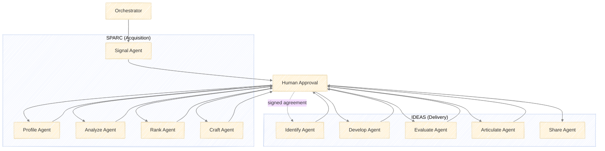
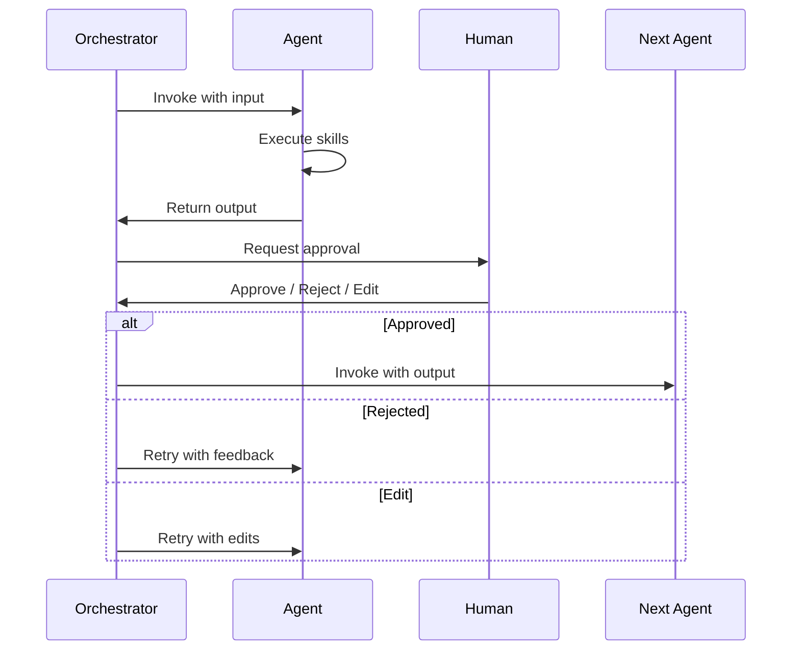
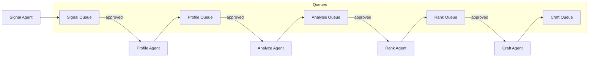

# Agent Architecture for SPARC + IDEAS

## Overview

Both frameworks decompose into **skills** (atomic instruction sets) that **agents** (specialists) invoke to complete stage objectives. An **orchestrator** routes work between agents, with **human approval gates** at each handoff.



---

## Skill Catalog

Skills are atomic, reusable instruction sets. Each skill has:
- **Purpose**: What it accomplishes
- **Inputs**: What it requires
- **Outputs**: What it produces
- **Tools**: MCP servers or APIs it uses

### Research Skills

| Skill | Purpose | Inputs | Outputs | Tools |
|-------|---------|--------|---------|-------|
| `web_search` | Search web for specific queries | Query string, filters | Ranked results with snippets | `web_search`, `web_fetch` |
| `company_lookup` | Retrieve firmographic data | Company name or domain | Structured company record | Crunchbase MCP, Clearbit API |
| `funding_monitor` | Track funding events | Vertical filters, amount thresholds | Funding event records | Crunchbase MCP, RSS feeds |
| `job_posting_search` | Find hiring signals | Company name, role keywords | Job listings with metadata | LinkedIn MCP, Indeed API |
| `social_monitor` | Track social posts by keywords/people | Keywords, account lists | Post records with engagement | LinkedIn MCP, Twitter API |
| `github_org_profile` | Analyze GitHub presence | Org name | Repo stats, activity metrics, contributors | GitHub MCP |
| `documentation_audit` | Assess docs quality | Docs URL | Structure analysis, gap identification | `web_fetch`, custom parser |
| `competitor_identification` | Find competitors | Company name, vertical | Competitor list with positioning | `web_search`, market databases |
| `review_aggregation` | Collect customer sentiment | Company name, product | Reviews with sentiment scores | G2 API, `web_fetch` (Reddit, HN) |
| `news_monitor` | Track company/vertical news | Company names, keywords | News items with summaries | Google Alerts, NewsAPI |

### Analysis Skills

| Skill | Purpose | Inputs | Outputs | Tools |
|-------|---------|--------|---------|-------|
| `competitive_analysis` | Compare company vs competitors | Company profile, competitor profiles | Gap matrix, positioning map | LLM synthesis |
| `gap_analysis` | Identify gaps between current/desired state | Current state doc, benchmark | Prioritized gap list | LLM synthesis |
| `signal_scoring` | Score signals by strength | Signal records, scoring criteria | Scored signal list | Rule engine or LLM |
| `prospect_scoring` | Score prospects against ICP | Prospect profile, ICP criteria, weights | Weighted score with breakdown | Rule engine or LLM |
| `market_sizing` | Estimate market opportunity | Vertical, segment criteria | TAM/SAM/SOM estimates | `web_search`, analyst reports |
| `hypothesis_generation` | Generate testable hypotheses | Opportunity description, constraints | Hypothesis statements with rationale | LLM synthesis |
| `feasibility_assessment` | Evaluate research feasibility | Hypothesis, available resources | Feasibility score, risk factors | LLM synthesis |
| `evidence_evaluation` | Assess evidence for/against hypothesis | Hypothesis, collected evidence | Support/refute assessment, confidence | LLM synthesis |

### Synthesis Skills

| Skill | Purpose | Inputs | Outputs | Tools |
|-------|---------|--------|---------|-------|
| `profile_synthesis` | Create structured company profile | Raw data from research skills | Company Profile document | LLM synthesis, template |
| `analysis_report` | Generate analysis report | Analysis outputs, template | Prospect Analysis Report | LLM synthesis, `docx` skill |
| `outreach_draft` | Draft personalized outreach | Prospect profile, analysis, templates | Outreach message variants | LLM synthesis |
| `proposal_draft` | Draft consulting proposal | Client needs, service offerings, pricing | Proposal document | LLM synthesis, `docx` skill |
| `research_brief` | Summarize research findings | Evidence, analysis | Research brief document | LLM synthesis, `docx` skill |
| `presentation_build` | Create slide deck | Content outline, template | Presentation file | `pptx` skill |

### Utility Skills

| Skill | Purpose | Inputs | Outputs | Tools |
|-------|---------|--------|---------|-------|
| `document_parse` | Extract structured data from documents | Document file | Structured content | `pdf` skill, `docx` skill |
| `template_fill` | Populate template with data | Template, data object | Filled document | Template engine |
| `data_store` | Persist data to storage | Data object, schema | Storage confirmation | Database, Airtable, Notion MCP |
| `data_retrieve` | Retrieve data from storage | Query, filters | Data records | Database, Airtable, Notion MCP |
| `notification_send` | Send notification to human | Message, channel | Delivery confirmation | Slack MCP, email API |
| `approval_request` | Request human approval | Context, options | Approval decision | Custom approval UI |

---

## Agent Definitions

Each agent has:
- **Role**: What it's responsible for
- **Skills**: Which skills it can invoke
- **Input**: What it receives to start
- **Output**: What it produces
- **Handoff Condition**: When it requests human approval to proceed

### SPARC Agents

#### Signal Agent
```yaml
role: Detect companies exhibiting buying signals
skills:
  - funding_monitor
  - job_posting_search
  - social_monitor
  - news_monitor
  - signal_scoring
  - data_store
input:
  - ICP criteria
  - Signal strength thresholds
  - Monitored sources config
output:
  - Signal Log (timestamped records)
  - Recommended prospects for profiling
handoff_condition: New high-priority signals detected
approval_prompt: |
  Found {n} new signals this period:
  {signal_summary}
  
  Recommend profiling: {prospect_list}
  
  Approve to proceed with profiling?
```

#### Profile Agent
```yaml
role: Build structured company profiles from public data
skills:
  - company_lookup
  - github_org_profile
  - documentation_audit
  - social_monitor
  - web_search
  - web_fetch
  - profile_synthesis
  - data_store
input:
  - Company identifiers (name, domain)
  - Profile template
output:
  - Company Profile document
handoff_condition: Profile complete
approval_prompt: |
  Completed profile for {company_name}:
  
  {profile_summary}
  
  Proceed to deep analysis?
```

#### Analyze Agent
```yaml
role: Conduct deep research on strategic gaps and opportunities
skills:
  - competitor_identification
  - competitive_analysis
  - review_aggregation
  - documentation_audit
  - gap_analysis
  - market_sizing
  - web_search
  - web_fetch
  - analysis_report
input:
  - Company Profile
  - Positioning statement
  - Analysis framework template
output:
  - Prospect Analysis Report
handoff_condition: Analysis complete
approval_prompt: |
  Completed analysis for {company_name}:
  
  Key findings:
  {findings_summary}
  
  Identified opportunities:
  {opportunities_list}
  
  Proceed to ranking?
```

#### Rank Agent
```yaml
role: Score prospects against qualification criteria
skills:
  - prospect_scoring
  - data_retrieve
  - data_store
input:
  - Prospect Analysis Report
  - Qualification criteria + weights
  - Current pipeline state
output:
  - Prospect Score with breakdown
  - Pipeline position recommendation
handoff_condition: Scoring complete
approval_prompt: |
  Scored {company_name}:
  
  {score_breakdown}
  
  Total: {total_score} — Recommendation: {recommendation}
  
  Proceed to craft outreach?
```

#### Craft Agent
```yaml
role: Develop tailored outreach based on analysis
skills:
  - outreach_draft
  - data_retrieve
  - web_search
input:
  - Prospect Analysis Report
  - Prospect Score
  - Outreach templates
  - Decision-maker profiles
output:
  - Outreach Message (multiple variants)
  - Supporting Brief (talking points)
handoff_condition: Outreach drafted
approval_prompt: |
  Drafted outreach for {company_name}:
  
  Target: {decision_maker}
  Channel: {channel}
  
  Message:
  {outreach_message}
  
  Approve to send? (or edit)
```

### IDEAS Agents

#### Identify Agent
```yaml
role: Surface research opportunities from client context
skills:
  - document_parse
  - gap_analysis
  - hypothesis_generation
  - web_search
  - data_store
input:
  - Client Contract Agreement
  - Client Analysis Report (from SPARC or separate)
output:
  - Research Opportunities list
  - Prioritized ideas with rationale
handoff_condition: Opportunities identified
approval_prompt: |
  Identified {n} research opportunities for {client_name}:
  
  {opportunities_summary}
  
  Recommended priority:
  {priority_ranking}
  
  Approve to develop hypotheses?
```

#### Develop Agent
```yaml
role: Transform opportunities into testable hypotheses
skills:
  - web_search
  - hypothesis_generation
  - feasibility_assessment
  - data_store
input:
  - Research Opportunities
  - Client constraints (timeline, resources, data)
output:
  - Hypothesis documents
  - Feasibility assessments
  - Scope definitions
handoff_condition: Hypotheses developed
approval_prompt: |
  Developed hypotheses for {opportunity_name}:
  
  {hypothesis_statements}
  
  Feasibility: {feasibility_summary}
  
  Proceed to evaluation?
```

#### Evaluate Agent
```yaml
role: Test theoretical claims against evidence
skills:
  - web_search
  - web_fetch
  - evidence_evaluation
  - data_store
input:
  - Hypothesis documents
  - Data sources
  - Evaluation criteria
output:
  - Evidence collection
  - Results interpretation
  - Problem-fit assessment
handoff_condition: Evaluation complete
approval_prompt: |
  Evaluation results for {hypothesis}:
  
  Evidence summary:
  {evidence_summary}
  
  Support level: {support_assessment}
  
  Proceed to articulate findings?
```

#### Articulate Agent
```yaml
role: Frame validated findings for maximum impact
skills:
  - research_brief
  - proposal_draft
  - presentation_build
  - web_search
input:
  - Evaluation results
  - Client context
  - Output format requirements
output:
  - Research deliverable (report, presentation, etc.)
  - Contribution positioning
  - Implementation roadmap
handoff_condition: Deliverable drafted
approval_prompt: |
  Drafted deliverable for {client_name}:
  
  Format: {format}
  Key contributions: {contributions}
  
  {deliverable_preview}
  
  Approve for sharing?
```

#### Share Agent
```yaml
role: Deliver outputs to relevant audiences
skills:
  - notification_send
  - data_store
  - web_search
input:
  - Approved deliverable
  - Distribution list
  - Delivery channels
output:
  - Delivery confirmation
  - Feedback collection setup
handoff_condition: Ready to deliver
approval_prompt: |
  Ready to deliver to {audience}:
  
  Channel: {channel}
  Recipients: {recipients}
  
  Confirm delivery?
```

---

## Shared Skills Across Frameworks

Many skills are used by multiple agents:

| Skill | SPARC Agents | IDEAS Agents |
|-------|--------------|--------------|
| `web_search` | Profile, Analyze, Craft | Identify, Develop, Evaluate, Articulate |
| `web_fetch` | Profile, Analyze | Evaluate |
| `gap_analysis` | Analyze | Identify |
| `data_store` | All | All |
| `data_retrieve` | Rank, Craft | Develop, Evaluate |
| `document_parse` | — | Identify |
| `hypothesis_generation` | — | Identify, Develop |

---

## MCP Integration Points

### Existing MCP Servers (Available)
- **Hugging Face**: Model search, paper search, dataset search — useful for Evaluate agent
- **Web Search/Fetch**: Core research capability — used across most agents

### Recommended MCP Servers (To Build or Find)

| MCP Server | Purpose | Used By |
|------------|---------|---------|
| `crunchbase-mcp` | Funding data, company profiles | Signal, Profile agents |
| `linkedin-mcp` | Social monitoring, job posts, people lookup | Signal, Profile, Craft agents |
| `github-mcp` | Org profiles, repo analysis | Profile agent |
| `notion-mcp` | Data storage, knowledge base | All agents |
| `airtable-mcp` | Pipeline CRM, structured data | All agents |
| `slack-mcp` | Notifications, approvals | Orchestrator |
| `google-alerts-mcp` | News monitoring | Signal agent |

### Custom MCP Server Candidates

```
crunchbase-mcp/
├── tools/
│   ├── company_lookup    — Get company by name/domain
│   ├── funding_search    — Search funding rounds by criteria
│   └── investor_lookup   — Get investor portfolio
└── resources/
    └── watchlist         — Monitored companies

linkedin-mcp/
├── tools/
│   ├── profile_lookup    — Get person/company profile
│   ├── job_search        — Search job postings
│   ├── post_search       — Search posts by keyword/author
│   └── connection_check  — Check connection path
└── resources/
    └── saved_searches    — Configured searches
```

---

## Orchestration Patterns

### Option A: Sequential with Approval Gates



### Option B: Event-Driven with Queues



### Option C: Graph-Based (LangGraph Style)

```python
# Pseudocode
from langgraph import StateGraph, END

workflow = StateGraph(PipelineState)

workflow.add_node("signal", signal_agent)
workflow.add_node("profile", profile_agent)
workflow.add_node("analyze", analyze_agent)
workflow.add_node("rank", rank_agent)
workflow.add_node("craft", craft_agent)
workflow.add_node("human_approval", human_approval_node)

workflow.add_edge("signal", "human_approval")
workflow.add_conditional_edges(
    "human_approval",
    route_after_approval,
    {
        "profile": "profile",
        "analyze": "analyze",
        "rank": "rank",
        "craft": "craft",
        "retry": "previous_node",
        "end": END
    }
)
```

---

## Skill File Structure

Each skill follows SKILL.md pattern:

```
skills/
├── research/
│   ├── web_search/
│   │   └── SKILL.md
│   ├── company_lookup/
│   │   └── SKILL.md
│   ├── funding_monitor/
│   │   └── SKILL.md
│   ├── job_posting_search/
│   │   └── SKILL.md
│   ├── github_org_profile/
│   │   └── SKILL.md
│   └── ...
├── analysis/
│   ├── competitive_analysis/
│   │   └── SKILL.md
│   ├── gap_analysis/
│   │   └── SKILL.md
│   ├── prospect_scoring/
│   │   └── SKILL.md
│   └── ...
├── synthesis/
│   ├── profile_synthesis/
│   │   └── SKILL.md
│   ├── analysis_report/
│   │   └── SKILL.md
│   ├── outreach_draft/
│   │   └── SKILL.md
│   └── ...
└── utility/
    ├── data_store/
    │   └── SKILL.md
    ├── approval_request/
    │   └── SKILL.md
    └── ...
```

### Example SKILL.md: `competitive_analysis`

```markdown
# Competitive Analysis Skill

## Purpose
Compare a target company against its competitors to identify positioning gaps and opportunities.

## Inputs
- `target_profile`: Company Profile document for the target
- `competitor_profiles`: List of Company Profile documents for competitors
- `dimensions`: Analysis dimensions (e.g., pricing, features, content, community)

## Outputs
- `gap_matrix`: Table of target vs competitors across dimensions
- `positioning_map`: Visual positioning summary
- `key_gaps`: Prioritized list of gaps with opportunity assessment
- `key_strengths`: Areas where target outperforms

## Process
1. Extract comparable attributes from each profile
2. Score each company on each dimension (1-5 scale)
3. Identify dimensions where target scores lowest relative to competitors
4. Identify dimensions where target scores highest
5. Assess opportunity value for each gap (market importance × feasibility)
6. Generate gap matrix and positioning summary

## Tools Required
- LLM for synthesis and scoring
- Template for gap matrix output

## Example Usage
```yaml
skill: competitive_analysis
inputs:
  target_profile: "./profiles/vultr.md"
  competitor_profiles:
    - "./profiles/digitalocean.md"
    - "./profiles/linode.md"
    - "./profiles/hetzner.md"
  dimensions:
    - documentation_depth
    - community_size
    - ai_ml_offerings
    - pricing_transparency
    - global_coverage
outputs:
  gap_matrix: "./analysis/vultr_gap_matrix.md"
  key_gaps: "./analysis/vultr_gaps.md"
```

## Quality Criteria
- All dimensions scored with evidence citations
- Gaps prioritized by opportunity value, not just size
- Strengths identified to inform positioning
```

---

## Implementation Recommendations

### Phase 1: Core Skills + Manual Orchestration
1. Implement `web_search`, `web_fetch`, `profile_synthesis`, `analysis_report` skills
2. Run orchestration manually (you invoke each agent, review, approve)
3. Store outputs in Notion/Airtable

### Phase 2: MCP Integration
1. Build or integrate `crunchbase-mcp` for Signal agent
2. Add `notion-mcp` or `airtable-mcp` for data persistence
3. Implement `approval_request` skill with Slack/email notification

### Phase 3: Automated Orchestration
1. Implement orchestrator (LangGraph recommended for graph-based routing)
2. Add feedback loops (retry with edits, route to earlier stage)
3. Build approval UI for reviewing agent outputs

### Phase 4: Monitoring + Learning
1. Track skill performance (success rate, time, quality)
2. Collect approval/rejection patterns
3. Refine skills based on feedback

---

## Open Questions

1. **State persistence**: Where does pipeline state live between agent runs? (Notion, Airtable, Postgres, file system)

2. **Skill versioning**: How to handle skill updates without breaking running pipelines?

3. **Multi-tenant**: Will this serve just you, or multiple consultants with different positioning/ICP?

4. **Cost controls**: LLM calls add up — implement token budgets per skill/agent?

5. **Feedback integration**: How do approval rejections feed back into skill improvement?
