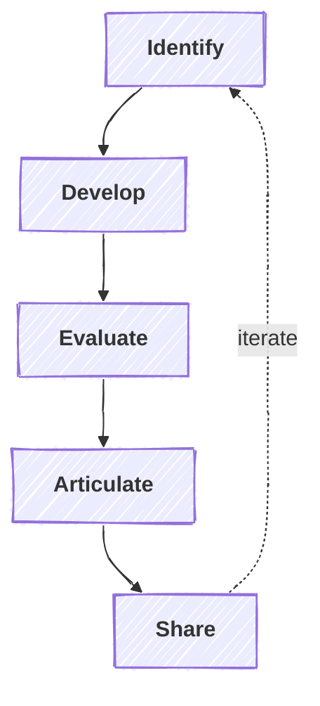

# The IDEAS Framework

A structured research methodology for client-focused research projects.

## Stages

### Identify
Surface research opportunities from client context.
- **Client Contract Agreement** — Scope of work, deliverables, and engagement boundaries
- **Client Analysis Report** — Deep-dive analysis identifying areas where you can provide value

These inputs are used to identify promising research directions and prioritize ideas.

### Develop
Transform identified opportunities into testable hypotheses.
- **Prior Work Review** — Survey existing research and identify gaps
- **Hypothesis Development** — Refine research questions into specific claims
- **Feasibility Assessment** — Evaluate data availability, resources, and timeline
- **Scope Definition** — Set boundaries, assumptions, and limitations

### Evaluate
Test theoretical claims against evidence.
- **Data Collection & Analysis** — Gather and analyze evidence
- **Results Interpretation** — Assess support for hypotheses, effect sizes, alternatives
- **Problem-Fit Check** — Verify findings address actual client needs
- **Quality Assurance** — Ensure rigor, reproducibility, and documentation

### Articulate
Frame validated findings for maximum impact.
- **Contribution Positioning** — Define what's new vs. existing knowledge
- **Audience Targeting** — Tailor communication format and framing
- **Competitive Differentiation** — Establish unique value proposition
- **Implementation Roadmap** — Outline recommendations and next steps

### Share
Deliver outputs to relevant audiences.
- **Pre-print / Publication** — Academic dissemination
- **Prototype / Proof-of-Concept** — Technical demonstration
- **Client Deliverable** — Reports, presentations, recommendations
- **Knowledge Transfer** — Training and handoff

## Feedback Loops

The framework includes explicit conditions that route back to earlier stages:

| From | Condition | To |
|------|-----------|-----|
| Develop | Idea not tractable | Identify |
| Evaluate | Wrong problem | Identify |
| Evaluate | Results don't support theory | Develop |
| Articulate | Weak novelty | Identify |
| Articulate | Overclaiming results | Evaluate |
| Share | Peer review rejection | Evaluate |
| Share | Implementation issues | Develop |
| Share | Client feedback | Articulate |
