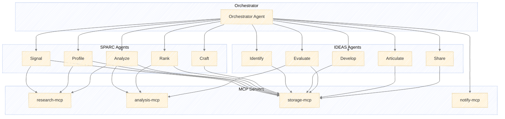
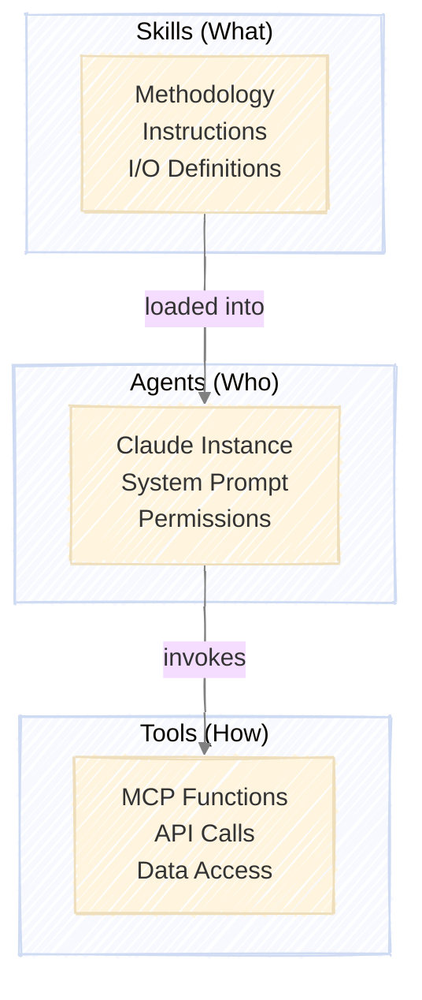
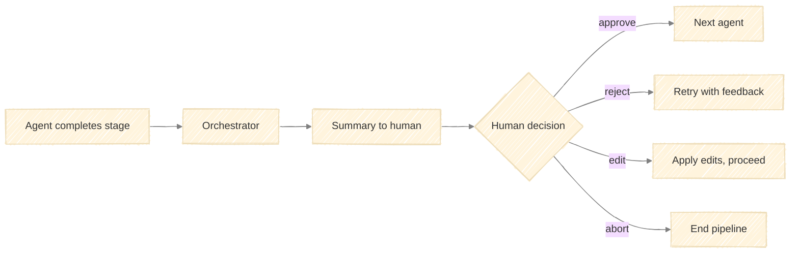
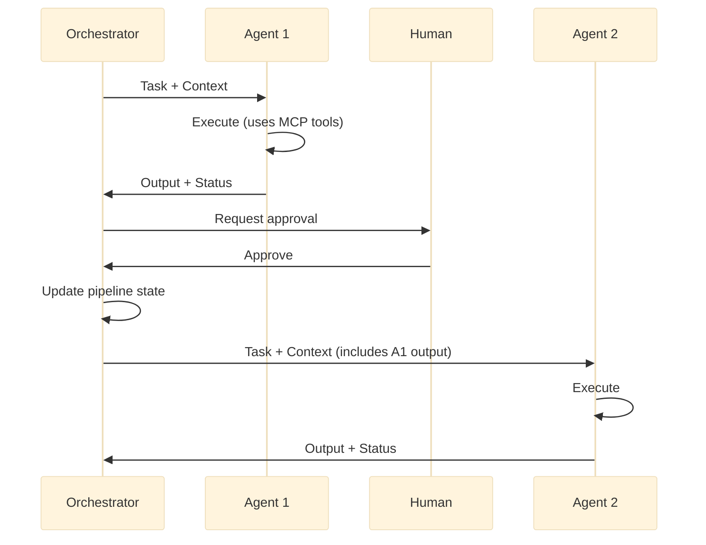

# Agent Architecture for PRAXIS

Claude Agent SDK with MCP integration for SPARC and IDEAS execution.



---

## Stack

| Component | Choice |
|-----------|--------|
| Agent Runtime | Claude Agent SDK |
| Tool Protocol | MCP |
| Model | Claude Sonnet 4.5 |
| Persistence | MCP storage server (Notion/Airtable/Postgres) |
| Notifications | MCP notify server (Slack/Email) |

---

## MCP Servers

### research-mcp

Web research and data collection.

| Tool | Purpose | Inputs | Outputs |
|------|---------|--------|---------|
| `web_search` | Search queries | query, filters | results[] |
| `web_fetch` | Fetch page content | url | content |
| `company_lookup` | Firmographic data | domain | company record |
| `job_search` | Find job postings | company, keywords | postings[] |
| `github_profile` | Org/repo analysis | org_name | profile |

### analysis-mcp

Structured analysis operations.

| Tool | Purpose | Inputs | Outputs |
|------|---------|--------|---------|
| `score_prospect` | Apply qualification scorecard | profile, criteria | score breakdown |
| `compare_competitors` | Gap matrix generation | target, competitors, dimensions | matrix |
| `evaluate_hypothesis` | Evidence assessment | hypothesis, evidence | verdict |

### storage-mcp

Persistence and retrieval.

| Tool | Purpose | Inputs | Outputs |
|------|---------|--------|---------|
| `save_document` | Store artifact | type, content, metadata | id |
| `get_document` | Retrieve artifact | id | content |
| `list_documents` | Query artifacts | type, filters | ids[] |
| `update_pipeline` | Update pipeline state | stage, status, data | confirmation |

### notify-mcp

Human interaction via interactive menus.

| Tool | Purpose | Inputs | Outputs |
|------|---------|--------|---------|
| `request_approval` | Stage approval gate | context, options[] | decision, feedback |
| `request_decision` | Multi-option choice | question, options[], multi_select | selection(s) |
| `request_clarification` | Input clarification | question, options[], context | selection, custom_input |
| `send_notification` | Alert human | channel, message | confirmation |

**Menu Option Structure:**
```python
{
    "label": str,        # Short display text (1-5 words)
    "description": str,  # Explanation of what this option means
    "value": str         # Value returned if selected
}
```

---

## Skills, Agents, and Tools

The architecture separates concerns into three layers:



| Layer | Purpose | Example |
|-------|---------|---------|
| **Skills** | Define *what* to do and *how* to think about it | `identify` skill defines the Identify stage methodology |
| **Agents** | Execute skills using available tools | `identify_agent` runs the identify skill |
| **Tools** | Perform actions and return data | `web_search` queries the web |

### Skill Loading

Each agent loads one stage-level skill that defines its complete methodology:

```python
def load_skill(stage: str) -> str:
    """Load skill definition for a stage."""
    path = f".claude/skills/{stage}/SKILL.md"
    return read_file(path)

INTERACTION_PROTOCOL = """
## Interaction Protocol

You MUST use interactive menus at decision points. Never proceed silently when user input is needed.

### Required Menu Calls

**Clarification (request_clarification)** — Call IMMEDIATELY when:
- Inputs are missing or incomplete
- Requirements are ambiguous
- Multiple valid interpretations exist
- You need to confirm understanding before proceeding

**Decision (request_decision)** — Call BEFORE acting when:
- Multiple valid approaches exist
- A threshold or boundary condition is met
- Feedback loop conditions are triggered
- Strategic direction is needed

**Approval (request_approval)** — Call AFTER completing stage work:
- Present summary of outputs produced
- Include quality criteria check results
- Offer approve/reject/edit/abort options

### Menu Format

Always structure options as:
- label: Short text (1-5 words)
- description: What this option means or does
- value: Machine-readable identifier

### Execution Pattern

1. Check inputs → if unclear, call request_clarification
2. Before each major decision → call request_decision
3. Execute work using MCP tools
4. Before stage completion → call request_approval with quality check
5. Wait for response before proceeding
"""

def build_agent_prompt(stage: str, framework: str) -> str:
    """Build complete agent system prompt."""
    return f"""
You are the {stage.title()} Agent for {framework.upper()}.

{load_skill(stage)}

{INTERACTION_PROTOCOL}

IMPORTANT: You must call menu tools (request_clarification, request_decision, request_approval) at every decision point defined in your skill. Never skip these interactions.
"""
```

### Skill-to-Agent Mapping

One skill per agent. Each skill contains the complete stage methodology:

| Agent | Skill | Description |
|-------|-------|-------------|
| **Signal** | `signal` | Detect and score prospect signals |
| **Profile** | `profile` | Build comprehensive company profiles |
| **Analyze** | `analyze` | Assess competitive position |
| **Rank** | `rank` | Score and prioritize prospects |
| **Craft** | `craft` | Create personalized outreach |
| **Identify** | `identify` | Define research opportunities |
| **Develop** | `develop` | Formalize hypotheses |
| **Evaluate** | `evaluate` | Test hypotheses |
| **Articulate** | `articulate` | Create deliverables |
| **Share** | `share` | Deliver and disseminate |

Skills define the *methodology* (what to do, in what order, what outputs to produce). Tools provide the *capabilities* (how to actually do it).

---

## Agent Definitions

Each agent is a Claude Agent SDK instance with:
- System prompt built from loaded skills
- MCP servers it can access
- Allowed tools matching skill requirements

### Orchestrator

```python
orchestrator = Agent(
    model="claude-sonnet-4-5-20250514",
    system_prompt=ORCHESTRATOR_PROMPT,
    mcp_servers=["storage-mcp", "notify-mcp"],
    allowed_tools=[
        "mcp__storage-mcp__*",
        "mcp__notify-mcp__request_approval"
    ]
)
```

**Responsibilities:**
- Route tasks to appropriate specialist agent
- Collect outputs and request human approval
- Manage pipeline state transitions
- Handle feedback loops (retry, reroute)

### SPARC Agents

#### Signal Agent

```python
signal_agent = Agent(
    model="claude-sonnet-4-5-20250514",
    system_prompt=build_agent_prompt("signal", "sparc"),
    mcp_servers=["research-mcp", "storage-mcp"],
    allowed_tools=[
        "mcp__research-mcp__web_search",
        "mcp__research-mcp__company_lookup",
        "mcp__research-mcp__job_search",
        "mcp__storage-mcp__save_document",
        "mcp__storage-mcp__list_documents"
    ]
)
```

#### Profile Agent

```python
profile_agent = Agent(
    model="claude-sonnet-4-5-20250514",
    system_prompt=build_agent_prompt("profile", "sparc"),
    mcp_servers=["research-mcp", "storage-mcp"],
    allowed_tools=[
        "mcp__research-mcp__web_search",
        "mcp__research-mcp__web_fetch",
        "mcp__research-mcp__company_lookup",
        "mcp__research-mcp__github_profile",
        "mcp__storage-mcp__save_document",
        "mcp__storage-mcp__get_document"
    ]
)
```

#### Analyze Agent

```python
analyze_agent = Agent(
    model="claude-sonnet-4-5-20250514",
    system_prompt=build_agent_prompt("analyze", "sparc"),
    mcp_servers=["research-mcp", "analysis-mcp", "storage-mcp"],
    allowed_tools=[
        "mcp__research-mcp__web_search",
        "mcp__research-mcp__web_fetch",
        "mcp__analysis-mcp__compare_competitors",
        "mcp__storage-mcp__*"
    ]
)
```

#### Rank Agent

```python
rank_agent = Agent(
    model="claude-sonnet-4-5-20250514",
    system_prompt=build_agent_prompt("rank", "sparc"),
    mcp_servers=["analysis-mcp", "storage-mcp"],
    allowed_tools=[
        "mcp__analysis-mcp__score_prospect",
        "mcp__storage-mcp__*"
    ]
)
```

#### Craft Agent

```python
craft_agent = Agent(
    model="claude-sonnet-4-5-20250514",
    system_prompt=build_agent_prompt("craft", "sparc"),
    mcp_servers=["research-mcp", "storage-mcp"],
    allowed_tools=[
        "mcp__research-mcp__web_search",
        "mcp__research-mcp__web_fetch",
        "mcp__storage-mcp__*"
    ]
)
```

### IDEAS Agents

#### Identify Agent

```python
identify_agent = Agent(
    model="claude-sonnet-4-5-20250514",
    system_prompt=build_agent_prompt("identify", "ideas"),
    mcp_servers=["research-mcp", "storage-mcp"],
    allowed_tools=[
        "mcp__research-mcp__web_search",
        "mcp__research-mcp__web_fetch",
        "mcp__storage-mcp__*"
    ]
)
```

#### Develop Agent

```python
develop_agent = Agent(
    model="claude-sonnet-4-5-20250514",
    system_prompt=build_agent_prompt("develop", "ideas"),
    mcp_servers=["research-mcp", "storage-mcp"],
    allowed_tools=[
        "mcp__research-mcp__web_search",
        "mcp__research-mcp__web_fetch",
        "mcp__storage-mcp__*"
    ]
)
```

#### Evaluate Agent

```python
evaluate_agent = Agent(
    model="claude-sonnet-4-5-20250514",
    system_prompt=build_agent_prompt("evaluate", "ideas"),
    mcp_servers=["research-mcp", "analysis-mcp", "storage-mcp"],
    allowed_tools=[
        "mcp__research-mcp__*",
        "mcp__analysis-mcp__evaluate_hypothesis",
        "mcp__storage-mcp__*"
    ]
)
```

#### Articulate Agent

```python
articulate_agent = Agent(
    model="claude-sonnet-4-5-20250514",
    system_prompt=build_agent_prompt("articulate", "ideas"),
    mcp_servers=["storage-mcp"],
    allowed_tools=[
        "mcp__storage-mcp__*"
    ]
)
```

#### Share Agent

```python
share_agent = Agent(
    model="claude-sonnet-4-5-20250514",
    system_prompt=build_agent_prompt("share", "ideas"),
    mcp_servers=["storage-mcp", "notify-mcp"],
    allowed_tools=[
        "mcp__storage-mcp__*",
        "mcp__notify-mcp__send_notification"
    ]
)
```

---

## Pipeline with Approval Gates

```mermaid
---
config:
  layout: dagre
  look: handDrawn
  theme: base
  themeVariables:
    lineColor: gray
---
flowchart TB
    subgraph SPARC
        S[Signal Agent] --> G1{Approve?}
        G1 --> |yes| P[Profile Agent]
        G1 --> |no| S
        P --> G2{Approve?}
        G2 --> |yes| A[Analyze Agent]
        G2 --> |no| P
        A --> G3{Approve?}
        G3 --> |yes| R[Rank Agent]
        G3 --> |no| A
        R --> G4{Approve?}
        G4 --> |yes| C[Craft Agent]
        G4 --> |no| R
        C --> G5{Approve?}
    end
    
    subgraph IDEAS
        G5 --> |signed| I[Identify Agent]
        I --> G6{Approve?}
        G6 --> |yes| D[Develop Agent]
        G6 --> |no| I
        D --> G7{Approve?}
        G7 --> |yes| E[Evaluate Agent]
        G7 --> |no| D
        E --> G8{Approve?}
        G8 --> |yes| Ar[Articulate Agent]
        G8 --> |no| E
        Ar --> G9{Approve?}
        G9 --> |yes| Sh[Share Agent]
        G9 --> |no| Ar
        Sh --> G10{Approve?}
        G10 --> |yes| Done[Complete]
    end
    
    G5 --> |rejected| S
```



---

## Human-in-the-Loop

Every stage transition requires human approval before proceeding.



**Approval Request Structure:**
```python
{
    "stage": "analyze",
    "agent": "analyze_agent",
    "summary": "Completed competitive analysis for Vultr...",
    "outputs": ["prospect_analysis_report_vultr.md"],
    "next_stage": "rank",
    "options": ["approve", "reject", "edit", "abort"]
}
```

**Human Response:**
```python
{
    "decision": "approve" | "reject" | "edit" | "abort",
    "feedback": "Optional feedback for retry",
    "edits": {"field": "new_value"}  # If decision is "edit"
}
```

---

## Interactive Menus

Interactive menus present structured choices at decision points throughout the pipeline. They replace free-form prompts with selectable options, improving consistency and reducing ambiguity.

### Menu Types

| Type | Tool | Use Case |
|------|------|----------|
| **Approval** | `request_approval` | Stage transitions, quality gates |
| **Decision** | `request_decision` | Strategy choices, approach selection |
| **Clarification** | `request_clarification` | Missing inputs, ambiguous requirements |

### When to Use Menus

**Always use menus for:**
- Stage approval gates (approve/reject/edit/abort)
- Feedback loop triggers (proceed/retry/reroute)
- Quality criteria validation (pass/fail per criterion)
- Strategy selection when multiple valid approaches exist
- Missing or ambiguous input clarification

**Use prose for:**
- Status updates and summaries
- Error messages requiring explanation
- Open-ended feedback collection

### Approval Menus

Stage transitions present a standard four-option menu:

```python
await request_approval(
    context={
        "stage": "analyze",
        "summary": "Completed competitive analysis for Vultr...",
        "outputs": ["prospect_analysis_report_vultr.md"],
        "quality_check": {"all_criteria_met": True}
    },
    options=[
        {"label": "Approve", "description": "Proceed to Rank stage", "value": "approve"},
        {"label": "Reject", "description": "Retry with feedback", "value": "reject"},
        {"label": "Edit", "description": "Modify outputs, then proceed", "value": "edit"},
        {"label": "Abort", "description": "End pipeline", "value": "abort"}
    ]
)
```

### Decision Menus

Present when the agent needs strategic direction:

```python
# Example: Rank stage threshold decision
await request_decision(
    question="Prospect scored 2.8 (Nurture threshold). How should we proceed?",
    options=[
        {"label": "Nurture", "description": "Add to nurture sequence, revisit in 30 days", "value": "nurture"},
        {"label": "Qualify anyway", "description": "Proceed to Craft despite score", "value": "qualify"},
        {"label": "Pass", "description": "Mark as not a fit, no further action", "value": "pass"}
    ]
)

# Example: Evaluate stage methodology choice
await request_decision(
    question="Which analysis approach for this hypothesis?",
    options=[
        {"label": "Quantitative", "description": "Statistical analysis of metrics data", "value": "quantitative"},
        {"label": "Qualitative", "description": "Interview-based thematic analysis", "value": "qualitative"},
        {"label": "Mixed methods", "description": "Combine both approaches", "value": "mixed"}
    ]
)
```

### Clarification Menus

Request missing information or resolve ambiguity:

```python
# Example: Signal stage - unclear priority
await request_clarification(
    question="Multiple hot signals detected. Which should we prioritize?",
    context="Found: Series B funding ($50M), VP Engineering hire, and API launch",
    options=[
        {"label": "Funding signal", "description": "Prioritize the Series B announcement", "value": "funding"},
        {"label": "Hiring signal", "description": "Prioritize the VP Engineering role", "value": "hiring"},
        {"label": "Product signal", "description": "Prioritize the API launch", "value": "product"},
        {"label": "All equally", "description": "Profile all signals with equal weight", "value": "all"}
    ]
)

# Example: Identify stage - scope clarification
await request_clarification(
    question="Contract mentions 'platform optimization'. Which interpretation?",
    context="Could mean performance, UX, or cost optimization",
    options=[
        {"label": "Performance", "description": "Speed, latency, throughput improvements", "value": "performance"},
        {"label": "User experience", "description": "Usability, accessibility, design", "value": "ux"},
        {"label": "Cost efficiency", "description": "Infrastructure and operational costs", "value": "cost"}
    ]
)
```

### Multi-Select Menus

For non-mutually-exclusive choices:

```python
# Example: Share stage - channel selection
await request_decision(
    question="Which channels for deliverable distribution?",
    options=[
        {"label": "Executive brief", "description": "Send summary to C-suite", "value": "exec"},
        {"label": "Technical report", "description": "Full report to engineering", "value": "tech"},
        {"label": "Workshop", "description": "Schedule interactive session", "value": "workshop"},
        {"label": "Documentation", "description": "Add to client knowledge base", "value": "docs"}
    ],
    multi_select=True
)
```

### Quality Check Menus

Present quality criteria as confirmable items:

```python
# Example: Before stage completion
await request_decision(
    question="Confirm quality criteria for Analyze stage:",
    options=[
        {"label": "Competitive comparison done", "description": "Gap matrix generated for all competitors", "value": "competition"},
        {"label": "Gaps tied to positioning", "description": "Each gap linked to service capability", "value": "gaps"},
        {"label": "Entry point identified", "description": "Clear path to engagement defined", "value": "entry"},
        {"label": "Budget estimated", "description": "Rough engagement value calculated", "value": "budget"}
    ],
    multi_select=True
)
```

### Feedback Loop Menus

When conditions trigger potential reroutes:

```python
# Example: Profile stage - insufficient data
await request_decision(
    question="Profile data incomplete (missing: funding history, tech stack). How to proceed?",
    options=[
        {"label": "Continue anyway", "description": "Proceed to Analyze with gaps noted", "value": "continue"},
        {"label": "Extended research", "description": "Return to Signal for deeper monitoring", "value": "signal"},
        {"label": "Manual input", "description": "I'll provide the missing data", "value": "manual"}
    ]
)

# Example: Evaluate stage - hypothesis not supported
await request_decision(
    question="Evidence does not support hypothesis H1. What next?",
    options=[
        {"label": "Revise hypothesis", "description": "Return to Develop with new framing", "value": "develop"},
        {"label": "Pivot scope", "description": "Return to Identify for new direction", "value": "identify"},
        {"label": "Report negative", "description": "Proceed to Articulate with null result", "value": "proceed"}
    ]
)
```

---

## Agent Handoffs

Agents do not communicate directly. All handoffs flow through the orchestrator with explicit state transfer.



**Handoff Protocol:**

| Step | Actor | Action |
|------|-------|--------|
| 1 | Orchestrator | Selects agent for current stage |
| 2 | Orchestrator | Prepares context (previous outputs, pipeline state) |
| 3 | Orchestrator | Delegates task to agent |
| 4 | Agent | Executes using allowed MCP tools |
| 5 | Agent | Returns output + completion status |
| 6 | Orchestrator | Validates output against stage criteria |
| 7 | Orchestrator | Requests human approval via notify-mcp |
| 8 | Human | Reviews, decides (approve/reject/edit/abort) |
| 9 | Orchestrator | Updates pipeline state in storage-mcp |
| 10 | Orchestrator | Routes to next agent or handles feedback |

**Context Passed Between Agents:**

| From | To | Context Includes |
|------|----|------------------|
| Signal | Profile | signal_log, company_identifiers |
| Profile | Analyze | company_profile, signal_log |
| Analyze | Rank | prospect_analysis, company_profile |
| Rank | Craft | qualification_score, prospect_analysis, key_people |
| Craft | Identify (IDEAS) | signed_agreement, prospect_analysis, outreach_brief |
| Identify | Develop | research_opportunities, contract_scope |
| Develop | Evaluate | hypothesis_documents, data_sources |
| Evaluate | Articulate | evaluation_report, evidence_collection |
| Articulate | Share | client_deliverable, audience_profile |

---

## Orchestration Flow

```python
async def run_pipeline(framework: str, initial_input: dict):
    """Run SPARC or IDEAS pipeline with approval gates."""
    
    stages = SPARC_STAGES if framework == "sparc" else IDEAS_STAGES
    state = {"input": initial_input, "outputs": {}}
    
    for stage in stages:
        agent = get_agent(stage)
        context = build_context(state, stage)
        
        # Execute agent
        output = await orchestrator.delegate(agent, context)
        state["outputs"][stage] = output
        
        # Human approval gate
        decision = await request_approval(stage, state)
        
        if decision["action"] == "reject":
            # Retry same stage with feedback
            state["feedback"] = decision["feedback"]
            continue
            
        if decision["action"] == "edit":
            state["outputs"][stage] = apply_edits(output, decision["edits"])
            
        if decision["action"] == "abort":
            return {"status": "aborted", "stage": stage, "state": state}
        
        # Persist state
        await save_pipeline_state(state)
    
    return {"status": "complete", "state": state}


SPARC_STAGES = ["signal", "profile", "analyze", "rank", "craft"]
IDEAS_STAGES = ["identify", "develop", "evaluate", "articulate", "share"]
```

---

## Approval Hooks

```python
async def approval_hook(tool_call):
    """Pre-tool-use hook for approval gates."""
    if tool_call.name == "mcp__notify-mcp__request_approval":
        # Always allow approval requests
        return tool_call
    
    # Log all tool calls for audit
    await log_tool_call(tool_call)
    return tool_call

async def request_approval(stage: str, state: dict) -> bool:
    """Request human approval before stage transition."""
    result = await orchestrator.use_tool(
        "mcp__notify-mcp__request_approval",
        {
            "context": {
                "stage": stage,
                "summary": summarize_state(state),
                "next_stage": get_next_stage(stage)
            },
            "options": ["approve", "reject", "edit"]
        }
    )
    
    if result["decision"] == "reject":
        await handle_rejection(stage, state, result.get("feedback"))
        return False
    
    if result["decision"] == "edit":
        state.update(result["edits"])
    
    return True
```

---

## Project Structure

```
praxis/
├── .claude/
│   └── skills/                    # Stage-level skill definitions
│       ├── signal/               # SPARC stages
│       ├── profile/
│       ├── analyze/
│       ├── rank/
│       ├── craft/
│       ├── identify/             # IDEAS stages
│       ├── develop/
│       ├── evaluate/
│       ├── articulate/
│       └── share/
├── agents/
│   ├── orchestrator.py
│   ├── skill_loader.py            # load_skill(), build_agent_prompt()
│   ├── sparc/
│   │   ├── signal.py
│   │   ├── profile.py
│   │   ├── analyze.py
│   │   ├── rank.py
│   │   └── craft.py
│   └── ideas/
│       ├── identify.py
│       ├── develop.py
│       ├── evaluate.py
│       ├── articulate.py
│       └── share.py
├── mcp_servers/
│   ├── research/
│   │   └── server.py
│   ├── analysis/
│   │   └── server.py
│   ├── storage/
│   │   └── server.py
│   └── notify/
│       └── server.py
├── config/
│   ├── mcp_servers.json
│   └── scoring_criteria.json
├── main.py
└── CLAUDE.md
```

Skills are stored in `.claude/skills/` following the Claude Code convention. Each stage has its own skill directory with a `SKILL.md` file defining the complete stage methodology: inputs, process steps, outputs, available tools, and quality criteria.

---

## Implementation Phases

### Phase 1: Core Infrastructure
1. Set up Claude Agent SDK
2. Implement storage-mcp (start with filesystem, migrate to Notion/Postgres)
3. Implement notify-mcp (start with CLI, add Slack later)
4. Create orchestrator with basic routing

### Phase 2: SPARC Pipeline
1. Implement research-mcp tools
2. Create SPARC agent prompts
3. Wire Signal → Profile → Analyze → Rank → Craft
4. Add approval gates

### Phase 3: IDEAS Pipeline
1. Implement analysis-mcp tools
2. Create IDEAS agent prompts
3. Wire Identify → Develop → Evaluate → Articulate → Share
4. Connect SPARC handoff to IDEAS intake

### Phase 4: Polish
1. Add persistent state across sessions
2. Implement feedback loops (retry, reroute)
3. Add observability/logging
4. Build simple UI for approvals

---

## Dependencies

```toml
[project]
dependencies = [
    "anthropic>=0.52.0",
    "claude-agent-sdk>=0.1.0",
    "mcp>=1.0.0",
    "httpx>=0.27.0",
    "pydantic>=2.0.0",
]

[project.optional-dependencies]
storage = ["notion-client", "airtable-python-wrapper", "asyncpg"]
notify = ["slack-sdk"]
```