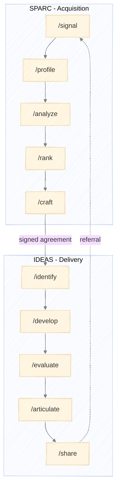

# Executing PRAXIS

How to run SPARC and IDEAS stages using Claude Code skills.



---

## Skills Overview

Each PRAXIS stage has a corresponding skill that defines its methodology:

| Methodology | Stage | Skill Command | Purpose |
|-------------|-------|---------------|---------|
| SPARC | Signal | `/signal` | Detect and score prospect signals |
| SPARC | Profile | `/profile` | Build comprehensive company profiles |
| SPARC | Analyze | `/analyze` | Assess competitive position |
| SPARC | Rank | `/rank` | Score and prioritize prospects |
| SPARC | Craft | `/craft` | Create personalized outreach |
| IDEAS | Identify | `/identify` | Define research opportunities |
| IDEAS | Develop | `/develop` | Formalize hypotheses |
| IDEAS | Evaluate | `/evaluate` | Test hypotheses |
| IDEAS | Articulate | `/articulate` | Create deliverables |
| IDEAS | Share | `/share` | Deliver and disseminate |

---

## Running a Stage

### 1. Invoke the Skill

Run the skill command for the stage you want to execute:

```
/signal
```

The skill will guide you through the stage methodology, prompting for inputs and decisions as needed.

### 2. Provide Inputs

Each stage expects specific inputs. The skill will request them or use outputs from prior stages:

| Stage | Required Inputs |
|-------|-----------------|
| Signal | Target criteria, signal types to monitor |
| Profile | Signal log with companies to profile |
| Analyze | Company profiles to analyze |
| Rank | Prospect analyses to score |
| Craft | Ranked prospects for outreach |
| Identify | Signed agreement, prospect analysis |
| Develop | Research agenda with opportunities |
| Evaluate | Hypothesis documents to test |
| Articulate | Evaluation reports to transform |
| Share | Client deliverables to distribute |

### 3. Work Through the Process

The skill executes its methodology:
- Performs research and analysis
- Presents findings
- Requests decisions at key points
- Produces stage outputs

### 4. Approve and Proceed

At stage completion, review outputs and approve to proceed:
- **Approve** - Move to next stage
- **Revise** - Adjust outputs before proceeding
- **Retry** - Re-run stage with different approach
- **Abort** - Exit pipeline

---

## Execution Patterns

### Sequential Execution

Run stages in order, completing each before starting the next:

```
/signal
[complete stage, approve outputs]

/profile
[complete stage, approve outputs]

/analyze
...
```

### Partial Pipeline

Run specific stages when you have existing inputs:

```
# Already have company profiles from other research
/analyze
[provide profiles, complete analysis]
```

### Cross-Framework Handoff

When SPARC produces a signed agreement, transition to IDEAS:

```
/craft
[outreach succeeds, agreement signed]

/identify
[provide agreement and analysis from SPARC]
```

---

## Decision Points

Skills present structured choices at key moments:

### Clarification Menus

When inputs are ambiguous:
- Multiple valid interpretations
- Missing information
- Conflicting data

### Decision Menus

When strategic direction is needed:
- Multiple valid approaches exist
- Threshold or boundary conditions met
- Feedback loop conditions triggered

### Approval Menus

At stage completion:
- Summary of outputs produced
- Quality criteria check results
- Options: approve / revise / retry / abort

---

## Feedback Loops

Some conditions route back to earlier stages:

### SPARC Feedback Loops

| Condition | From | To |
|-----------|------|-----|
| Insufficient public data | Profile | Signal (monitor) |
| Problem doesn't match positioning | Analyze | Pass or Nurture |
| Score below threshold | Rank | Nurture or Pass |
| No response after 2 touches | Craft | Nurture |
| Response but no fit | Craft | Pass |

### IDEAS Feedback Loops

| Condition | From | To |
|-----------|------|-----|
| Idea not tractable | Develop | Identify |
| Wrong problem | Evaluate | Identify |
| Results don't support theory | Evaluate | Develop |
| Weak novelty | Articulate | Identify |
| Overclaiming results | Articulate | Evaluate |
| Implementation issues | Share | Develop |

When a feedback condition is triggered, the skill will present options and guide you to the appropriate stage.

---

## Document Management

### During Execution

Skills produce outputs as structured documents. Save these for:
- Input to subsequent stages
- Client deliverables
- Reference and audit

### Recommended Structure

```
project/
├── sparc/
│   ├── signal_log.md
│   ├── profiles/
│   │   └── [company].md
│   ├── analyses/
│   │   └── [company].md
│   ├── rankings.md
│   └── outreach/
│       └── [company].md
└── ideas/
    ├── research_agenda.md
    ├── hypotheses/
    │   └── [hypothesis].md
    ├── evaluations/
    │   └── [hypothesis].md
    ├── deliverables/
    │   └── [deliverable].md
    └── delivery_log.md
```

---

## Quality Gates

Each stage has quality criteria that must be met before approval:

### Verification

Before approving stage output, confirm:
- All required outputs produced
- Quality criteria checklist passed
- Outputs ready for next stage consumption

### Common Issues

| Issue | Resolution |
|-------|------------|
| Missing data | Note gaps, proceed with caveats or return to prior stage |
| Conflicting information | Resolve via clarification menu or document uncertainty |
| Quality criteria not met | Revise outputs before approval |
| Scope creep | Defer items to future or separate engagement |

---

## Tips

### Starting Fresh

Begin with `/signal` and work through SPARC sequentially. This builds context and ensures each stage has proper inputs.

### Resuming Work

If continuing from a prior session:
1. Review where you left off
2. Provide relevant prior outputs as context
3. Run the appropriate stage skill

### Parallel Prospects

For multiple prospects in SPARC:
- Run Signal once to generate full log
- Profile hot prospects in sequence or batch
- Analyze and Rank together for comparison
- Craft individually for personalization

### Multiple Engagements

For concurrent IDEAS engagements:
- Keep separate document folders per client
- Run stages independently per engagement
- Track status per engagement
