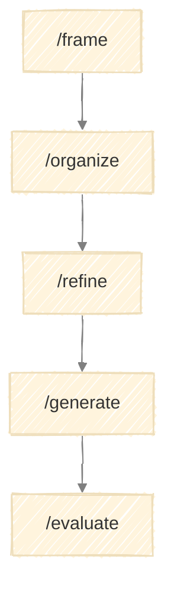

# Execution Guide

How to run the Framework Generator using skills.



---

## Skills Overview

| Stage | Skill | Purpose |
|-------|-------|---------|
| Frame | `/frame` | Define framework purpose and boundaries |
| Organize | `/organize` | Map stages and flow |
| Refine | `/refine` | Specify each stage in detail |
| Generate | `/generate` | Produce framework and skill files |
| Evaluate | `/evaluate` | Validate and iterate |

---

## Running a Stage

### 1. Invoke the Skill

```
/frame
```

The skill guides you through the stage, prompting for inputs and decisions.

### 2. Provide Inputs

Each stage expects specific inputs:

| Stage | Required Inputs |
|-------|-----------------|
| Frame | Problem description, context |
| Organize | Framework charter |
| Refine | Stage map |
| Generate | Charter, stage map, stage specifications |
| Evaluate | Generated files |

### 3. Work Through the Process

The skill:
- Performs analysis
- Presents findings
- Requests decisions at key points
- Produces stage outputs

### 4. Approve and Proceed

At stage completion, review outputs and choose:
- **Approve** - Move to next stage
- **Revise** - Adjust outputs before proceeding
- **Retry** - Re-run stage with different approach
- **Abort** - Exit

---

## Execution Patterns

### Sequential Execution

Run stages in order:

```
/frame
[approve]

/organize
[approve]

/refine
[approve]

/generate
[approve]

/evaluate
[approve]
```

### Partial Execution

Start from any stage if you have prior outputs:

```
# Already have charter and stage map
/refine
[provide existing artifacts]
```

---

## Decision Points

### Clarification Menus

When inputs are ambiguous:
- Multiple valid interpretations
- Missing information
- Conflicting requirements

### Decision Menus

When strategic direction is needed:
- Multiple valid approaches
- Threshold conditions met
- Feedback loop triggered

### Approval Menus

At stage completion:
- Summary of outputs
- Quality criteria check
- Options: approve / revise / retry / abort

---

## Feedback Loops

Some conditions route back to earlier stages:

| From | Condition | To |
|------|-----------|-----|
| Organize | Stages don't cover the problem | Frame |
| Refine | Stage purpose unclear | Organize |
| Evaluate | Gaps in specifications | Refine |
| Evaluate | Structural issues | Organize |
| Evaluate | Scope creep detected | Frame |

---

## Output Structure

```
output/
└── {date}/{name}/
    ├── run.md                        # Run log with progress tracking
    │
    ├── 1-frame/
    │   └── charter.md                # Framework charter
    │
    ├── 2-organize/
    │   └── stage-map.md              # Stage map with flow diagram
    │
    ├── 3-refine/
    │   └── {stage}-spec.md           # Stage specification (one per stage)
    │
    ├── 4-generate/                   # Generated framework (portable)
    │   ├── README.md
    │   ├── CLAUDE.md
    │   ├── docs/
    │   │   └── {name}.md
    │   └── .claude/skills/
    │       └── {stage}/SKILL.md
    │
    └── 5-evaluate/
        └── validation.md             # Validation report
```

The generated framework in `4-generate/` is self-contained and can be copied to any location.

### Naming

- Date folders: `output/YYYY-MM-DD/`
- Multiple runs same day: Add suffix (`2026-01-08-02`)

### Run Log Conventions

The run log (`run.md`) tracks progress and decisions across stages.

**Initialize** (Frame stage):

```markdown
# Framework Run: {Name}

Started: {date}
Status: in_progress

## Progress

| # | Stage | Status | Started | Completed |
|---|-------|--------|---------|-----------|
| 1 | Frame | → in_progress | {time} | - |
| 2 | Organize | ○ pending | - | - |
| 3 | Refine | ○ pending | - | - |
| 4 | Generate | ○ pending | - | - |
| 5 | Evaluate | ○ pending | - | - |

---

## 1. Frame - {date}

**Inputs provided:**
- Problem: {summary}
- Context: {summary}

**Decisions:**
| Question | Choice |
|----------|--------|
| {question} | {selection} |

**Output:** `1-frame/charter.md`
```

**Update progress** (each stage):

Update the Progress table:
- Current stage: `→ in_progress`
- Completed stages: `✓ complete`
- Pending stages: `○ pending`

**Append** (Organize, Refine, Generate stages):

```markdown
---

## {#}. {Stage} - {date}

**Decisions:**
| Question | Choice |
|----------|--------|
| {question} | {selection} |

**Output:** `{#}-{stage}/{filename}.md`
```

**Finalize** (Evaluate stage):

```markdown
---

## 5. Evaluate - {date}

**Checks performed:**
- Convention compliance: {pass/fail}
- Completeness: {pass/fail}
- Consistency: {pass/fail}
- Dry run: {pass/fail}

**Decisions:**
| Question | Choice |
|----------|--------|
| {question} | {selection} |

**Output:** `5-evaluate/validation.md`

---

## Outcome

**Status:** complete / aborted
**Result:** {name} framework created with {n} stages
**Location:** `4-generate/`
```

---

## Quality Gates

Before approving, confirm:
- All required outputs produced
- Quality criteria checklist passed
- Outputs ready for next stage

### Common Issues

| Issue | Resolution |
|-------|------------|
| Missing data | Note gaps, proceed with caveats |
| Conflicting info | Resolve via clarification menu |
| Criteria not met | Revise before approval |
| Scope creep | Defer to future work |
