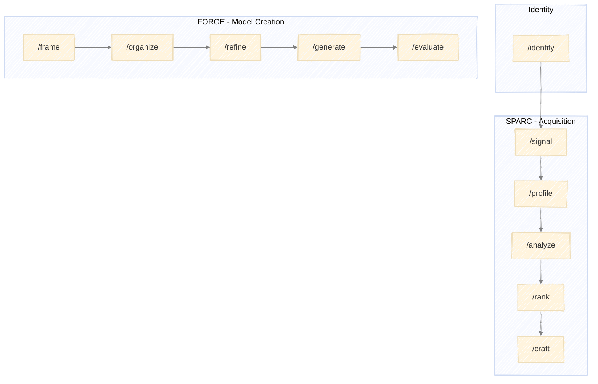

# Executing PRAXIS

How to run PRAXIS components using Claude Code skills.



---

## Skills Overview

Each PRAXIS component has corresponding skills:

| Component | Stage | Skill Command | Purpose |
|-----------|-------|---------------|---------|
| Identity | - | `/identity` | Define professional identity profile |
| SPARC | Signal | `/signal` | Detect and score prospect signals |
| SPARC | Profile | `/profile` | Build comprehensive company profiles |
| SPARC | Analyze | `/analyze` | Assess competitive position |
| SPARC | Rank | `/rank` | Score and prioritize prospects |
| SPARC | Craft | `/craft` | Create personalized outreach |
| FORGE | Frame | `/frame` | Define model purpose and boundaries |
| FORGE | Organize | `/organize` | Map stages and flow |
| FORGE | Refine | `/refine` | Specify each stage in detail |
| FORGE | Generate | `/generate` | Produce model and skill files |
| FORGE | Evaluate | `/evaluate` | Validate and iterate |

**Note:** Run `/identity` once before starting SPARC. The Identity profile provides foundational inputs that inform the model.

---

## Running a Stage

### 1. Invoke the Skill

Run the skill command for the stage you want to execute:

```
/signal
```

The skill will guide you through the stage, prompting for inputs and decisions as needed.

### 2. Provide Inputs

Each stage expects specific inputs. The skill will request them or use outputs from prior stages:

| Stage | Required Inputs |
|-------|-----------------|
| Identity | Name, LinkedIn URL (recommended), portfolio URL (recommended), other links (optional) |
| Signal | Identity profile, target criteria, signal types, lookback window |
| Profile | Identity profile, signal log, priority tier |
| Analyze | Identity profile, company profiles, analysis dimensions |
| Rank | Identity profile, prospect analyses, scoring criteria, thresholds |
| Craft | Identity profile, priority ranking, prospect analyses, channel |

### 3. Work Through the Process

The skill executes its process:
- Performs research and analysis
- Presents findings
- Requests decisions at key points
- Produces stage outputs

### 4. Approve and Proceed

At stage completion, review outputs and approve to proceed:
- **Approve** - Move to next stage
- **Revise** - Adjust outputs before proceeding
- **Retry** - Re-run stage with different approach
- **Abort** - Exit pipeline

---

## Execution Patterns

### Sequential Execution

Run stages in order, completing each before starting the next:

```
/signal
[complete stage, approve outputs]

/profile
[complete stage, approve outputs]

/analyze
...
```

### Partial Pipeline

Run specific stages when you have existing inputs:

```
# Already have company profiles from other research
/analyze
[provide profiles, complete analysis]
```

---

## Decision Points

Skills present structured choices at key moments:

### Clarification Menus

When inputs are ambiguous:
- Multiple valid interpretations
- Missing information
- Conflicting data

### Decision Menus

When strategic direction is needed:
- Multiple valid approaches exist
- Threshold or boundary conditions met
- Feedback loop conditions triggered

### Approval Menus

At stage completion:
- Summary of outputs produced
- Quality criteria check results
- Options: approve / revise / retry / abort

---

## Feedback Loops

Some conditions route back to earlier stages. When a feedback condition is triggered, the skill presents options and guides you to the appropriate stage.

For the complete feedback loop definitions, see:
- [SPARC Feedback Loops](../models/sparc.md#feedback-loops)
- [FORGE Feedback Loops](../models/forge.md#feedback-loops)

---

## Output Structure

Stage outputs are saved to a structured folder:

```
output/
├── identity/
│   └── profile.md                  # Single file, reused across runs
├── sparc/
│   └── YYYY-MM-DD/
│       ├── run.md                  # Run log (decisions at each stage)
│       ├── signal-log.md
│       ├── {company}-profile.md
│       ├── {company}-analysis.md
│       ├── qualification.md
│       └── {company}-outreach.md
└── forge/
    └── YYYY-MM-DD/
        ├── run.md                  # Run log (decisions at each stage)
        ├── {model}-charter.md
        ├── {model}-stage-map.md
        ├── {model}-{stage}-spec.md
        └── {model}-validation.md
```

### Naming Convention

- **Identity**: Single `output/identity/profile.md`, updated when positioning shifts
- **SPARC runs**: Date folder under `output/sparc/YYYY-MM-DD/` (sorts chronologically)
- **FORGE runs**: Date folder under `output/forge/YYYY-MM-DD/`
- **Multiple runs same day**: Add suffix (`2026-01-08`, `2026-01-08-02`, `2026-01-08-03`)

### Output Files

| Component | Stage | File |
|-----------|-------|------|
| Identity | - | `output/identity/profile.md` |
| SPARC | Signal | `run.md`, `signal-log.md` |
| SPARC | Profile | `{company}-profile.md` |
| SPARC | Analyze | `{company}-analysis.md` |
| SPARC | Rank | `qualification.md` |
| SPARC | Craft | `{company}-outreach.md` |
| FORGE | Frame | `run.md`, `{model}-charter.md` |
| FORGE | Organize | `{model}-stage-map.md` |
| FORGE | Refine | `{model}-{stage}-spec.md` |
| FORGE | Generate | Model + skill files (in codebase) |
| FORGE | Evaluate | `{model}-validation.md` |

---

## Quality Gates

Each stage has quality criteria that must be met before approval:

### Verification

Before approving stage output, confirm:
- All required outputs produced
- Quality criteria checklist passed
- Outputs ready for next stage consumption

### Common Issues

| Issue | Resolution |
|-------|------------|
| Missing data | Note gaps, proceed with caveats or return to prior stage |
| Conflicting information | Resolve via clarification menu or document uncertainty |
| Quality criteria not met | Revise outputs before approval |
| Scope creep | Defer items to future or separate engagement |

---

## Tips

### Starting Fresh

Begin with `/identity` to create your professional identity profile. Then run `/signal` and work through SPARC sequentially. This builds context and ensures each stage has proper inputs.

### Resuming Work

If continuing from a prior session:
1. Review where you left off
2. Provide relevant prior outputs as context
3. Run the appropriate stage skill

### Parallel Prospects

For multiple prospects in SPARC:
- Run Signal once to generate full log
- Profile hot prospects in sequence or batch
- Analyze and Rank together for comparison
- Craft individually for personalization
