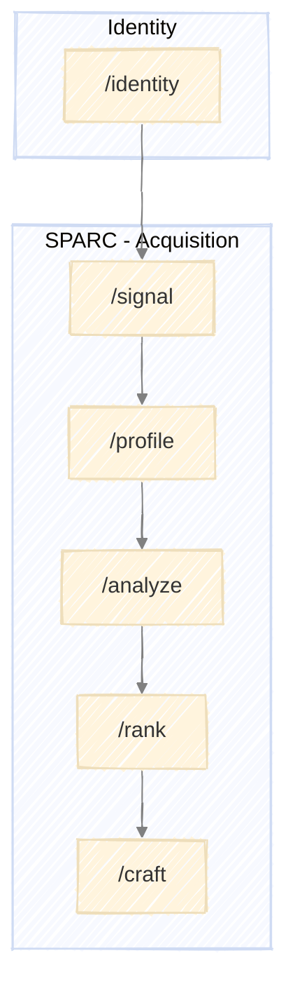

# Executing PRAXIS

How to run PRAXIS components using Claude Code skills.



---

## Skills Overview

Each PRAXIS component has corresponding skills:

| Component | Stage | Skill Command | Purpose |
|-----------|-------|---------------|---------|
| Identity | - | `/identity` | Define professional identity profile |
| SPARC | Signal | `/signal` | Detect and score prospect signals |
| SPARC | Profile | `/profile` | Build comprehensive company profiles |
| SPARC | Analyze | `/analyze` | Assess competitive position |
| SPARC | Rank | `/rank` | Score and prioritize prospects |
| SPARC | Craft | `/craft` | Create personalized outreach |

**Note:** Run `/identity` once before starting SPARC. The Identity profile provides foundational inputs that inform the model.

---

## Running a Stage

### 1. Invoke the Skill

Run the skill command for the stage you want to execute:

```
/signal
```

The skill will guide you through the stage, prompting for inputs and decisions as needed.

### 2. Provide Inputs

Each stage expects specific inputs. The skill will request them or use outputs from prior stages:

| Stage | Required Inputs |
|-------|-----------------|
| Identity | Name, LinkedIn URL (recommended), portfolio URL (recommended), other links (optional) |
| Signal | Identity profile, target criteria, signal types, lookback window |
| Profile | Identity profile, signal log, profile template, priority tier |
| Analyze | Identity profile, company profiles, analysis dimensions |
| Rank | Identity profile, prospect analyses, scoring criteria, thresholds |
| Craft | Identity profile, priority ranking, prospect analyses, outreach templates, channel |

### 3. Work Through the Process

The skill executes its process:
- Performs research and analysis
- Presents findings
- Requests decisions at key points
- Produces stage outputs

### 4. Approve and Proceed

At stage completion, review outputs and approve to proceed:
- **Approve** - Move to next stage
- **Revise** - Adjust outputs before proceeding
- **Retry** - Re-run stage with different approach
- **Abort** - Exit pipeline

---

## Execution Patterns

### Sequential Execution

Run stages in order, completing each before starting the next:

```
/signal
[complete stage, approve outputs]

/profile
[complete stage, approve outputs]

/analyze
...
```

### Partial Pipeline

Run specific stages when you have existing inputs:

```
# Already have company profiles from other research
/analyze
[provide profiles, complete analysis]
```

---

## Decision Points

Skills present structured choices at key moments:

### Clarification Menus

When inputs are ambiguous:
- Multiple valid interpretations
- Missing information
- Conflicting data

### Decision Menus

When strategic direction is needed:
- Multiple valid approaches exist
- Threshold or boundary conditions met
- Feedback loop conditions triggered

### Approval Menus

At stage completion:
- Summary of outputs produced
- Quality criteria check results
- Options: approve / revise / retry / abort

---

## Feedback Loops

Some conditions route back to earlier stages. When a feedback condition is triggered, the skill presents options and guides you to the appropriate stage.

For the complete feedback loop definitions, see:
- [SPARC Feedback Loops](../models/sparc.md#feedback-loops)

---

## Artifact Persistence

Each PRAXIS run persists two things:
1. **Decision log** - What the user decided at each stage and why
2. **Artifacts** - Complete outputs from each stage

### Run-Based Structure

```
praxis/
├── identity/
│   └── profile.md                        # Your professional identity
│
├── runs/
│   ├── 2025-01-15_vultr_sparc/
│   │   ├── run.yaml                    # Run metadata (state tracking)
│   │   ├── decisions.md                # Decision log
│   │   └── artifacts/
│   │       ├── 1_signal_2025-01-15/
│   │       │   └── signal_log.md
│   │       ├── 2_profile_2025-01-16/
│   │       │   └── company_profile.md
│   │       ├── 3_analyze_2025-01-17/
│   │       │   ├── prospect_analysis.md
│   │       │   └── competitor_matrix.md
│   │       ├── 4_rank_2025-01-18/
│   │       │   └── qualification_score.md
│   │       └── 5_craft_2025-01-19/
│   │           ├── outreach_message.md
│   │           └── outreach_brief.md
│   │
│   └── 2025-01-20_streamdata_sparc/
│       └── ...
│
├── nurture/                            # Prospects in nurture state
│   └── cloudscale.md
│
└── passed/                             # Archived pass records
    └── acme.md
```

### Run Naming Convention

```
YYYY-MM-DD_[entity-slug]_sparc
```

- **Date**: Run start date
- **Entity**: Prospect name, lowercase with hyphens
- **Type**: `sparc`

Examples:
- `2025-01-15_vultr_sparc`
- `2025-01-20_streamdata_sparc`

### Artifact Folder Naming

Each stage produces a folder with a stage number, name, and completion date:

```
[stage_number]_[stage_name]_[YYYY-MM-DD]/
```

| Stage | Folder |
|-------|--------|
| 1 | `1_signal_YYYY-MM-DD/` |
| 2 | `2_profile_YYYY-MM-DD/` |
| 3 | `3_analyze_YYYY-MM-DD/` |
| 4 | `4_rank_YYYY-MM-DD/` |
| 5 | `5_craft_YYYY-MM-DD/` |

Files within each folder use descriptive names without prefixes (e.g., `signal_log.md`, `company_profile.md`).

### Starting a Run

When beginning a new SPARC execution:

1. Create run directory: `praxis/runs/YYYY-MM-DD_entity_sparc/`
2. Initialize `run.yaml` with metadata
3. Create empty `decisions.md`
4. Create `artifacts/` directory

### During Execution

At each stage completion:

1. Create stage folder in `artifacts/` using naming convention
2. Save all stage outputs to the folder
3. Append decision entry to `decisions.md`
4. Update `run.yaml` with current stage

### Completing a Run

When run finishes:

1. Update `run.yaml` status to `completed`
2. Set outcome (`signed_agreement`, `nurture`, `pass`, etc.)
3. For nurture/pass outcomes, copy record to `nurture/` or `passed/`

See [run.md](run.md) for `run.yaml` and `decisions.md` templates.

---

## Quality Gates

Each stage has quality criteria that must be met before approval:

### Verification

Before approving stage output, confirm:
- All required outputs produced
- Quality criteria checklist passed
- Outputs ready for next stage consumption

### Common Issues

| Issue | Resolution |
|-------|------------|
| Missing data | Note gaps, proceed with caveats or return to prior stage |
| Conflicting information | Resolve via clarification menu or document uncertainty |
| Quality criteria not met | Revise outputs before approval |
| Scope creep | Defer items to future or separate engagement |

---

## Tips

### Starting Fresh

Begin with `/identity` to create your professional identity profile. Then run `/signal` and work through SPARC sequentially. This builds context and ensures each stage has proper inputs.

### Resuming Work

If continuing from a prior session:
1. Review where you left off
2. Provide relevant prior outputs as context
3. Run the appropriate stage skill

### Parallel Prospects

For multiple prospects in SPARC:
- Run Signal once to generate full log
- Profile hot prospects in sequence or batch
- Analyze and Rank together for comparison
- Craft individually for personalization
