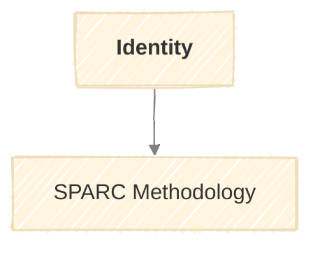

# The Identity Methodology

A structured assessment for defining your professional identity to inform client acquisition.

## Purpose

Define who you are professionally so that SPARC finds better-fit opportunities. Without a clear identity, acquisition becomes scattershot.

**Run:** Once to initialize, update when positioning shifts.

---

## Inputs

The assessment requires:

| Input | Required | Description |
|-------|----------|-------------|
| Name | Yes | Your professional name |
| LinkedIn | Recommended | Profile URL for experience extraction |
| Portfolio | Recommended | Website or work samples |
| GitHub | Optional | Technical activity |
| Other Links | Optional | Publications, talks, social presence |

---

## Process

The assessment has four phases, executed in a single session:

### 1. Collect

Gather basic inputs from the user:
- Professional name
- URLs to public profiles (LinkedIn, portfolio, GitHub)
- Any additional context the user wants to provide

### 2. Discover

Research provided links to extract:

| Source | Extract |
|--------|---------|
| LinkedIn | Roles, companies, tenure, skills listed, recommendations |
| Portfolio | Project types, industries served, outcomes highlighted |
| GitHub | Languages, contribution patterns, notable projects |
| Publications | Topics, venues, recency |
| Social | Themes discussed, audience engagement |

### 3. Enquire

Ask targeted questions to fill gaps and clarify positioning:

| Category | Sample Questions |
|----------|------------------|
| Expertise | What are you genuinely expert at? What do you want to be known for? |
| Experience | Which past projects are you most proud of? What industries have you worked in? |
| Services | What do you offer? What do you refuse to do? |
| Ideal Client | What makes a client ideal? What are warning signs? |
| Differentiation | What do you do that others don't? Why should someone hire you? |
| Constraints | Rate expectations? Availability? Location preferences? Deal-breakers? |

Questions adapt based on what was discovered in phase 2. Don't ask what's already evident.

### 4. Synthesize

Combine findings into a structured Markdown profile covering:

| Section | Content |
|---------|---------|
| Identity | Name, tagline, contact |
| Positioning | Who you help, with what, your differentiation |
| Expertise | Skills, methods, tools |
| Experience | Industries, notable projects, outcomes |
| Services | Offerings, price points, engagement types |
| Ideal Client | Characteristics, signals, red flags |
| Constraints | Rates, availability, geography, deal-breakers |

---

## Output

A single Markdown profile document covering all sections from the Synthesize phase.

See [templates.md](../.claude/skills/identity/templates.md) for the complete template and example.

---

## Integration with SPARC

The Identity profile informs every SPARC stage:

| SPARC Stage | Profile Input Used |
|-------------|-------------------|
| Signal | `ideal_client.signals` - Which buying indicators to weight |
| Profile | `ideal_client.characteristics` - Criteria for comparison |
| Analyze | `positioning.differentiation`, `expertise` - Finding angles |
| Rank | `ideal_client`, `constraints` - Scoring weights |
| Craft | `positioning`, `services` - Value proposition and messaging |

---

## Quality Criteria

- [ ] All mandatory inputs collected
- [ ] Public sources researched (not just self-reported)
- [ ] Positioning statement is specific, not generic
- [ ] Ideal client characteristics are actionable filters
- [ ] Red flags identified from experience
- [ ] Constraints are concrete, not vague
- [ ] Profile is succinct (fits in context window)

---

## Maintenance

Update your Identity profile when:
- You add a new service offering
- Your positioning shifts
- You learn new deal-breakers from bad experiences
- Your rate or availability changes significantly
- You gain experience in a new industry

The profile is a living document, not a one-time exercise.
