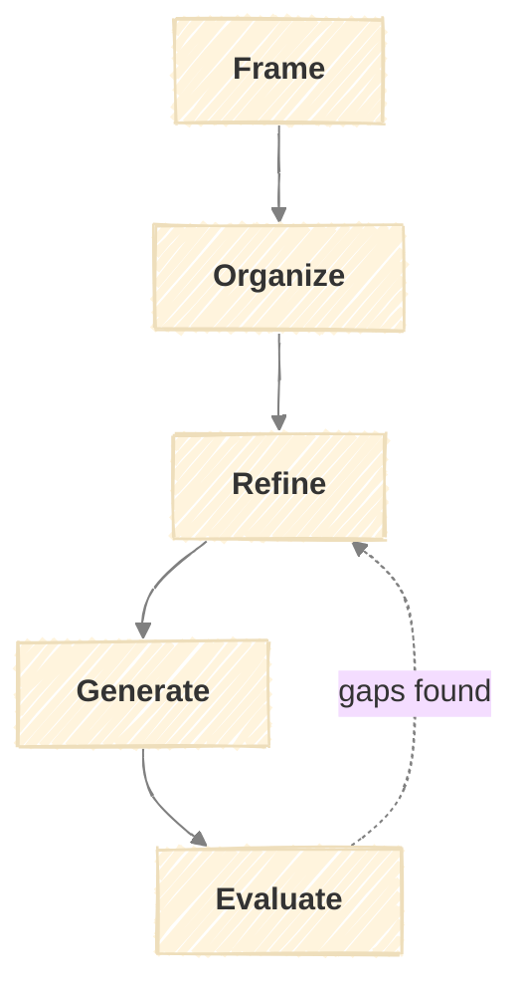

# The FORGE Model

A meta-model for creating new models within the PRAXIS framework.



## Purpose

FORGE creates new models by guiding you through a structured design process. Use it when:

- You need a repeatable workflow for a domain PRAXIS doesn't cover
- An existing model needs to be split or restructured
- You're extending the framework for others to use

**Output:** A complete model (document + skill files) ready for execution.

---

## Inputs

FORGE requires:

| Input | Required | Description |
|-------|----------|-------------|
| Problem description | Yes | What workflow or process needs systematizing |
| Context | Yes | Domain, constraints, who will use it |
| Existing patterns | Recommended | Reference models to draw from (e.g., SPARC) |

FORGE does not depend on Identity - it's a framework development tool.

---

## Outputs

All FORGE artifacts are saved to `output/forge/{date}/` where `{date}` is the run start date (YYYY-MM-DD).

| Artifact | Path | Created At |
|----------|------|------------|
| Run log | `output/forge/{date}/run.md` | Frame (updated each stage) |
| Model charter | `output/forge/{date}/{model}-charter.md` | Frame |
| Stage map | `output/forge/{date}/{model}-stage-map.md` | Organize |
| Stage specs | `output/forge/{date}/{model}-{stage}-spec.md` | Refine |
| Validation report | `output/forge/{date}/{model}-validation.md` | Evaluate |

### Run Log (run.md)

Tracks decisions made at each stage. Updated after each stage approval.

```markdown
# FORGE Run: {Model Name}

Started: {date}
Status: in_progress / complete / aborted

---

## Frame - {date}

**Inputs provided:**
- Problem: {summary}
- Context: {summary}

**Decisions:**
| Question | Choice | Rationale |
|----------|--------|-----------|
| {question asked} | {option selected} | {why} |

**Output:** `{model}-charter.md`

---

## Organize - {date}

**Decisions:**
| Question | Choice | Rationale |
|----------|--------|-----------|
| {question asked} | {option selected} | {why} |

**Output:** `{model}-stage-map.md`

---

## {Stage} - {date}
...

---

## Outcome

**Status:** complete / aborted
**Result:** {model name} model created with {n} stages
**Files generated:** {list}
```

---

## Stages

### Frame

Define purpose and boundaries.

| Activity | Inputs | Outputs |
|----------|--------|---------|
| Problem Definition | Problem description | Problem statement |
| Purpose Articulation | Problem statement, context | Purpose statement |
| Boundary Setting | Purpose, context | Scope (in/out) |
| Trigger Identification | Purpose, usage patterns | Trigger conditions |
| Type Determination | Purpose, flow needs | Model type (foundation/pipeline) |

**Model Types:**

| Type | Characteristics | Example |
|------|-----------------|---------|
| Foundation | Single assessment, run once, feeds other models | Identity |
| Pipeline | Sequential stages, ongoing execution, feedback loops | SPARC |

**Output:** Model Charter

```markdown
# Model Charter: [NAME]

## Problem
[What workflow/process does this address?]

## Purpose
[Why does this model need to exist?]

## Scope
**In:** [What's covered]
**Out:** [What's excluded]

## Triggers
[When should this model be run?]

## Type
[Foundation / Pipeline]

## Dependencies
[Other models this requires as input, if any]
```

---

### Organize

Map stages and flow.

| Activity | Inputs | Outputs |
|----------|--------|---------|
| Stage Identification | Model charter | Stage list with purposes |
| Flow Mapping | Stage list, type | Flow diagram |
| Dependency Mapping | Charter, other models | Integration points |
| Loop Definition | Flow, failure modes | Feedback loops table |
| Terminal States | Flow, outcomes | Exit conditions |

**Flow Patterns:**

| Pattern | When to Use |
|---------|-------------|
| Linear | Each stage feeds the next, no branching |
| Branching | Different paths based on conditions |
| Cyclical | Repeating execution (e.g., weekly cadence) |
| Hub | Central stage that others connect to |

**Output:** Stage Map

```markdown
# Stage Map: [NAME]

## Stages
| Stage | Purpose | Inputs | Outputs |
|-------|---------|--------|---------|
| [Name] | [What it does] | [What it needs] | [What it produces] |

## Flow
[Mermaid diagram]

## Dependencies
| This Model Needs | From |
|------------------|------|
| [Input] | [Source model/stage] |

## Feedback Loops
| From | Condition | To |
|------|-----------|-----|
| [Stage] | [When this happens] | [Go here] |

## Terminal States
| State | Definition | Actions |
|-------|------------|---------|
| [Name] | [When reached] | [What to do] |
```

---

### Refine

Specify each stage in detail.

| Activity | Inputs | Outputs |
|----------|--------|---------|
| Activity Definition | Stage map | Activities table per stage |
| Context Tables | Domain knowledge | Supporting reference tables |
| Output Templating | Stage outputs | Output format per stage |
| Criteria Definition | Quality standards | Checklist per stage |

**Stage Specification Structure:**

Each stage needs:

| Component | Purpose |
|-----------|---------|
| Activities table | What happens, with inputs/outputs |
| Context tables | Reference information (criteria, categories, etc.) |
| Output format | Template or structure for stage output |
| Quality criteria | Checklist for completion |

**Output:** Complete Stage Specifications (one per stage)

```markdown
# Stage Specification: [STAGE NAME]

## Activities
| Activity | Inputs | Outputs |
|----------|--------|---------|
| [Action] | [What it needs] | [What it produces] |

## [Context Table Name]
| [Column] | [Column] |
|----------|----------|
| [Data] | [Data] |

## Output Format
[Template block showing expected output structure]

## Quality Criteria
- [ ] [Criterion 1]
- [ ] [Criterion 2]
```

---

### Generate

Produce model document and skill files.

| Activity | Inputs | Outputs |
|----------|--------|---------|
| Model Document | Charter, stage map, specifications | `docs/models/{name}.md` |
| Skill Files | Specifications | `.claude/skills/{stage}/SKILL.md` |
| Index Updates | New model | Updated `overview.md`, `CLAUDE.md`, `README.md` |
| Guide Updates | New model | Updated `execution.md` |

**File Structure:**

```
docs/models/{model-name}.md          # Model definition
.claude/skills/{stage-1}/SKILL.md    # Stage 1 skill (includes output templates)
.claude/skills/{stage-2}/SKILL.md    # Stage 2 skill
...
```

**Skill File Structure:**

```markdown
---
name: {stage-name}
description: {One-line description for skill picker}
---

# {Stage Name}

{Brief purpose statement}

## Inputs
| Input | Source |
|-------|--------|
| {input} | {where it comes from} |

### Input Format

**From {source} (`{path}`):**

```markdown
{Expected structure}
```

## Process
**1. {Step}** - {Description}
**2. {Step}** - {Description}

## Output

Save to `output/{model}/{date}/`.

| File | Content |
|------|---------|
| `{output-file}.md` | {Description} |

### {Output File} ({filename}.md)

```markdown
{Template with placeholders}
```

## Quality Criteria
- [ ] {Criterion}

## Completion
{What to present, next action}
```

**Output:** Complete file set ready for use

---

### Evaluate

Validate and iterate.

| Activity | Inputs | Outputs |
|----------|--------|---------|
| Convention Check | Generated files, framework patterns | Compliance report |
| Completeness Audit | Files, specification | Gap list |
| Dry Run | First stage skill | Execution notes |
| Refinement | Gaps, notes | Updated specifications |

**Convention Checklist:**

- [ ] Model document follows structure (purpose, inputs, stages, loops, criteria)
- [ ] Each stage has activities table with inputs/outputs
- [ ] Quality criteria are actionable checklists
- [ ] Feedback loops have clear conditions
- [ ] Skills have frontmatter (name, description)
- [ ] Skills have input format section after inputs table
- [ ] Skills follow inputs → input format → process → output → criteria → completion structure
- [ ] Output templates embedded in skill Output section
- [ ] Mermaid diagrams render correctly

**Output:** Validation Report + Refined Artifacts

```markdown
# Validation Report: [MODEL NAME]

## Convention Compliance
- [x] / [ ] {Each checklist item}

## Gaps Found
| Location | Issue | Resolution |
|----------|-------|------------|
| {File/section} | {Problem} | {Fix needed} |

## Dry Run Notes
{Observations from attempting first stage}

## Status
[Ready / Needs refinement]
```

---

## Feedback Loops

| From | Condition | To |
|------|-----------|-----|
| Organize | Stages don't cover the problem | Frame (refine scope) |
| Refine | Stage purpose unclear | Organize (clarify stage) |
| Evaluate | Gaps in specifications | Refine |
| Evaluate | Structural issues | Organize |
| Evaluate | Scope creep detected | Frame |

---

## Quality Criteria

**Frame:**
- [ ] Problem is specific, not generic
- [ ] Purpose explains why this model vs. ad-hoc process
- [ ] Scope boundaries are clear
- [ ] Model type matches the workflow pattern

**Organize:**
- [ ] Stages are distinct (no overlap)
- [ ] Flow is logical (outputs feed inputs)
- [ ] Dependencies on other models identified
- [ ] Feedback loops cover failure modes

**Refine:**
- [ ] Every stage has activities with clear I/O
- [ ] Output formats are specific templates, not vague descriptions
- [ ] Quality criteria are checkboxes, not prose

**Generate:**
- [ ] All files follow framework conventions
- [ ] Skills are executable (not just documentation)
- [ ] Index documents updated

**Evaluate:**
- [ ] Dry run attempted
- [ ] All convention checks passed
- [ ] Gaps resolved or documented

---

## Stage Outputs Summary

| Stage | Output | Format |
|-------|--------|--------|
| Frame | Model Charter | Structured markdown |
| Organize | Stage Map | Markdown + mermaid diagram |
| Refine | Stage Specifications | Markdown per stage |
| Generate | Model + Skills | File set |
| Evaluate | Validation Report | Markdown |
