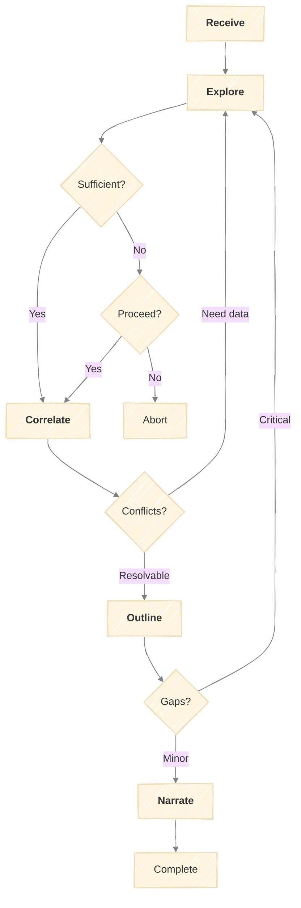

# The RECON Model

A structured model for deep individual research and profile synthesis.

## Purpose

Systematically research individuals before engagement. Without structure, research is time-consuming, incomplete, inconsistent, and produces findings that are hard to act on.

RECON provides:
- Comprehensive coverage across all relevant sources
- Consistent, structured output every time
- Synthesized findings with actionable insights
- Defined workflow instead of ad-hoc searching

---

## Inputs

RECON is standalone and does not require outputs from other models.

| Input | Required | Description |
|-------|----------|-------------|
| Name | Yes | Full name of the subject |
| Identifiers | Yes | At least one verifiable identifier (link, handle, email) |
| Context | Yes | Research purpose and relationship |

---

## Outputs

All RECON artifacts save to `output/recon/{date}/` where `{date}` is the run start date.

| Artifact | Path | Created At |
|----------|------|------------|
| Run log | `output/recon/{date}/run.md` | Receive (updated each stage) |
| Seed file | `output/recon/{date}/{subject}-seed.md` | Receive |
| Explore findings | `output/recon/{date}/{subject}-explore.md` | Explore |
| Correlated findings | `output/recon/{date}/{subject}-correlate.md` | Correlate |
| Outline | `output/recon/{date}/{subject}-outline.md` | Outline |
| Final profile | `output/recon/{date}/{subject}-profile.md` | Narrate |

---

## Stages

### Receive

Collect initial identifiers and context to seed the research process.

| Activity | Inputs | Outputs |
|----------|--------|---------|
| Gather identifiers | User-provided name, handles, links | Identifier list |
| Clarify context | User input on purpose and relationship | Research context |
| Identify known connections | User knowledge of affiliations | Starting points list |
| Set research scope | Context, purpose | Scope parameters |

**Identifier Types:**

| Type | Examples | Priority |
|------|----------|----------|
| Full name | Legal name, professional name | Required |
| Social handles | LinkedIn, Twitter/X, GitHub | High |
| Email | Personal, work | High |
| Location | City, country | Medium |
| Employer | Current and past | Medium |

**Output:** Seed file with identifiers, context, and starting points

---

### Explore

Systematically search across all source categories to gather raw findings.

| Activity | Inputs | Outputs |
|----------|--------|---------|
| Search professional platforms | Seed identifiers | LinkedIn, company findings |
| Search social media | Handles | Twitter/X, Instagram findings |
| Search developer platforms | Identifiers | GitHub, Stack Overflow findings |
| Search content platforms | Name, topics | Blog, publication findings |
| Search news/media | Name, company | News mentions, interviews |
| Search public records | Name, location | Public records findings |
| Assess data sufficiency | All findings | Sufficiency determination |

**Source Categories:**

| Category | Sources |
|----------|---------|
| Professional | LinkedIn, company sites, Crunchbase |
| Social | Twitter/X, Instagram, Facebook, TikTok |
| Developer | GitHub, GitLab, Stack Overflow |
| Content | Personal blog, Medium, Substack, YouTube |
| Academic | Google Scholar, ResearchGate |
| News | Google News, industry publications |
| Podcasts | Spotify, Apple Podcasts |
| Public Records | Court records, property, business filings |
| Aggregators | People-search sites |

**Output:** Raw findings organized by source with sufficiency assessment

---

### Correlate

Cross-reference findings to verify accuracy, resolve conflicts, and identify patterns.

| Activity | Inputs | Outputs |
|----------|--------|---------|
| Verify identity consistency | All findings | Identity verification status |
| Cross-reference facts | Findings by category | Corroborated facts |
| Identify conflicts | Overlapping claims | Conflict log |
| Assign confidence levels | Corroboration status | Confidence-rated findings |
| Detect patterns | All findings | Pattern observations |

**Confidence Levels:**

| Level | Criteria |
|-------|----------|
| High | 3+ sources agree, or 1 authoritative source |
| Medium | 2 sources agree, or 1 reliable source |
| Low | Single source, unverified |

**Output:** Correlated findings with confidence levels and conflict resolution

---

### Outline

Structure correlated findings into organized categories and identify gaps.

| Activity | Inputs | Outputs |
|----------|--------|---------|
| Categorize findings | Correlated facts | Categorized findings |
| Assess completeness | Categorized findings | Completeness rating |
| Identify gaps | Assessment | Gap list with criticality |
| Prioritize information | Purpose, gaps | Priority-ranked findings |

**Profile Categories:**

| Category | Criticality |
|----------|-------------|
| Identity | Required |
| Professional | Required |
| Education | Medium |
| Network | Medium |
| Interests | Medium |
| Content | Low |
| Communication | Low |
| Values | Low |

**Output:** Structured outline with gap analysis

---

### Narrate

Synthesize findings into a cohesive profile with actionable insights.

| Activity | Inputs | Outputs |
|----------|--------|---------|
| Write executive summary | All findings | One-paragraph summary |
| Synthesize professional narrative | Professional findings | Career story |
| Synthesize personal narrative | Personal findings | Personal portrait |
| Generate insights | Patterns, purpose | Actionable insights |
| Create talking points | Insights | Conversation starters |
| Note caveats | Gaps, low-confidence items | Limitations |

**Insight Types:**

| Type | Purpose |
|------|---------|
| Connection point | Shared interest or experience |
| Conversation starter | Topic likely to engage |
| Approach recommendation | How to frame outreach |
| Caution | Something to be aware of |
| Opportunity | Potential collaboration area |

**Output:** Complete profile with summary, narratives, insights, and talking points

---

## Feedback Loops

| From | Condition | To |
|------|-----------|-----|
| Explore | Insufficient data | User decision (proceed/abort) |
| Correlate | Unresolvable conflicts | Explore |
| Outline | Critical gaps | Explore |

---

## Quality Criteria

**Receive:**
- [ ] At least name provided
- [ ] At least one verifiable identifier
- [ ] Research purpose stated
- [ ] Depth/scope defined

**Explore:**
- [ ] All source categories checked
- [ ] Each source marked found/not found
- [ ] Data sufficiency assessed

**Correlate:**
- [ ] Identity verified or status clear
- [ ] All facts have confidence level
- [ ] Conflicts logged with resolution

**Outline:**
- [ ] All categories assessed
- [ ] Gaps identified with criticality
- [ ] No critical gaps remaining

**Narrate:**
- [ ] Summary captures essence
- [ ] Insights are actionable
- [ ] Sources documented
- [ ] Caveats honest about limitations

---

## Stage Outputs Summary

| Stage | Output | Format |
|-------|--------|--------|
| Receive | Seed file | Identifiers + context |
| Explore | Raw findings | By source category |
| Correlate | Correlated findings | Confidence-rated facts |
| Outline | Structured outline | Categorized + gaps |
| Narrate | Final profile | Synthesized document |
