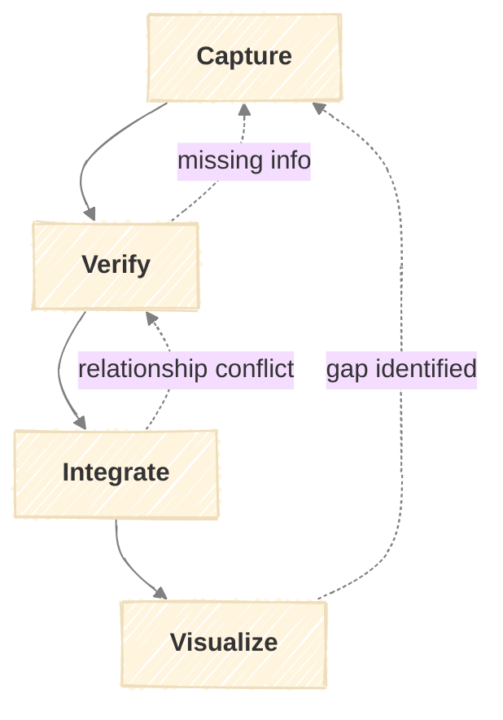

# The ROOTS Framework

Recording Our Origins Through Stories - a framework for building family trees through systematic interview capture, verification, and visualization.

## Purpose

Systematize family tree building through interview-driven data capture. This framework addresses:

- **Scattered data** - Information across conversations, documents, and memory
- **No systematic approach** - Unclear what to ask or record
- **Verification challenges** - Conflicting accounts and uncertain dates

A framework maximizes learning from time-limited family interview opportunities.

---

## Inputs

| Input | Required | Description |
|-------|----------|-------------|
| Interview access | Yes | Family members willing to share information |
| Existing tree data | No | Previous ROOTS run output (for ongoing building) |

---

## Stages

### Capture

Record person information and relationships from family interviews.

**Activities:**

| Activity | Inputs | Outputs |
|----------|--------|---------|
| Prepare interview questions | Gap analysis (if any), target person | Question list focused on unknowns |
| Conduct interview | Family member, question list | Raw notes with quotes and attributions |
| Extract person records | Raw notes | Person entries with source tags |
| Extract relationships | Raw notes, person entries | Relationship entries linking people |
| Tag uncertainties | All entries | Entries marked with confidence indicators |

**Relationship Types:**

| Category | Types |
|----------|-------|
| Core | Parent, Child, Spouse, Sibling |
| Extended | Grandparent, Grandchild, Aunt/Uncle, Niece/Nephew, Cousin, In-law |
| Complex | Step-parent, Step-child, Step-sibling, Half-sibling, Adoptive parent, Adoptive child |

**Data Fields:**

| Field | Required | Example |
|-------|----------|---------|
| Name | Yes | "Muhammad Ali Khan" |
| Also known as | No | "Uncle Ali", maiden name |
| Birth date | No | "1945", "March 1945", "1945-03-15" |
| Birth place | No | "Lahore", "Lahore, Pakistan" |
| Death date | No | Same formats as birth |
| Death place | No | Same as birth place |
| Source | Yes | "Interview with Grandmother, 2026-01-09" |
| Notes | No | Context, stories, uncertainties |

**Quality Criteria:**

- [ ] Every person has a name and source
- [ ] Relationships specify both people and type
- [ ] Uncertainties are explicitly listed
- [ ] Dates use consistent format (even partial dates)
- [ ] Source attribution present for each claim

---

### Verify

Cross-reference captured information against existing data and resolve conflicts.

**Activities:**

| Activity | Inputs | Outputs |
|----------|--------|---------|
| Check for duplicates | Capture session, existing tree | Duplicate candidates list |
| Merge duplicates | Duplicate candidates | Consolidated person records |
| Cross-reference claims | Person records, existing data | Conflict report |
| Resolve conflicts | Conflict report | Resolution decisions with rationale |
| Assign confidence | Resolved records | Records with confidence levels |

**Confidence Levels:**

| Level | Criteria | Action |
|-------|----------|--------|
| High | 2+ independent sources agree | Ready for integration |
| Medium | Single source, no contradictions | Flag for future corroboration |
| Low | Conflicting sources, uncertainty noted | Needs additional verification |

**Conflict Types:**

| Type | Example | Resolution Approach |
|------|---------|---------------------|
| Date mismatch | Birth year 1945 vs 1947 | Prefer documented over remembered, note discrepancy |
| Name spelling | "Ahmed" vs "Ahmad" | Record both as aliases, pick canonical |
| Relationship disagreement | "Sister" vs "cousin" | Interview additional family member |
| Missing data | Death date unknown | Mark as unknown, add to gap list |

**Quality Criteria:**

- [ ] All captured records have been checked
- [ ] Duplicates explicitly resolved (merged or marked distinct)
- [ ] Conflicts documented with resolution rationale
- [ ] Every record has a confidence level
- [ ] Low-confidence items have clear next steps

---

### Integrate

Add verified person records to the canonical family tree and establish relationship links.

**Activities:**

| Activity | Inputs | Outputs |
|----------|--------|---------|
| Load existing tree | Tree data file | Current tree state |
| Add new people | Verified records, existing tree | Updated people list |
| Create relationships | Relationship entries, people list | Linked relationship graph |
| Validate consistency | Updated tree | Consistency check results |
| Save tree | Validated tree | Updated tree data file |

**Relationship Validation Rules:**

| Rule | Check | On Failure |
|------|-------|------------|
| No orphan relationships | Both people in relationship exist | Add missing person or remove link |
| No duplicate relationships | Same pair not linked twice same way | Merge or clarify |
| Logical consistency | Parent older than child | Flag for verification |
| No circular ancestry | Person not their own ancestor | Flag as data error |

**Quality Criteria:**

- [ ] All verified records integrated
- [ ] Each person has a unique identifier
- [ ] All relationships link to existing people
- [ ] No logical inconsistencies in relationships
- [ ] Changelog reflects all changes
- [ ] Tree file saved successfully

---

### Visualize

Generate tree views, identify gaps, and plan next capture sessions.

**Activities:**

| Activity | Inputs | Outputs |
|----------|--------|---------|
| Generate tree diagram | Tree data | Visual family tree (mermaid) |
| Calculate statistics | Tree data | Tree metrics summary |
| Identify gaps | Tree data, relationship rules | Gap analysis report |
| Prioritize gaps | Gap analysis, access to family | Prioritized interview targets |
| Export data | Tree data, export format | Exported file |

**View Types:**

| View | Purpose | Shows |
|------|---------|-------|
| Ancestor tree | Trace lineage upward | Parents, grandparents, etc. from a focus person |
| Descendant tree | Trace lineage downward | Children, grandchildren from a focus person |
| Full tree | Complete picture | All people and relationships |
| Confidence map | Data quality overview | Color-coded by confidence level |

**Gap Types:**

| Gap | Detection | Priority |
|-----|-----------|----------|
| Missing parents | Person has no parent links | High if person is in direct line |
| Unknown dates | Birth or death date empty | Medium |
| Single source | Confidence = Medium, needs corroboration | Low |
| Unconnected person | No relationships to rest of tree | High |
| Generation gap | Missing intermediate generation | High |

**Export Formats:**

| Format | Use Case |
|--------|----------|
| Markdown | Human-readable, version controlled |
| GEDCOM | Import to genealogy software |
| JSON | Machine processing, backups |

**Quality Criteria:**

- [ ] Tree diagram renders correctly
- [ ] Statistics are accurate
- [ ] All gaps categorized and prioritized
- [ ] Next steps are actionable
- [ ] Export completes without errors (if requested)

---

## Feedback Loops

| From | Condition | To |
|------|-----------|-----|
| Verify | Missing information needed for verification | Capture |
| Integrate | Relationship conflicts detected during integration | Verify |
| Visualize | Gap analysis identifies missing family members | Capture |

---

## Terminal States

| State | Definition | Actions |
|-------|------------|---------|
| Session Complete | All captured data verified and integrated | Export updated tree, note gaps for next session |
| Blocked | Conflicting information cannot be resolved | Document conflict, flag for future resolution |
| Paused | Awaiting interview opportunity or document access | Record what's needed, schedule next capture |

---

## Stage Outputs Summary

| Stage | Output | Format |
|-------|--------|--------|
| Capture | Capture session | Markdown with people, relationships, uncertainties |
| Verify | Verification report | Markdown with confidence assignments |
| Integrate | Integration report | Markdown with changes, updated tree data |
| Visualize | Visualization | Mermaid diagram, statistics, gap analysis |
