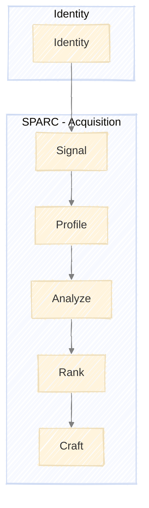

# The PRAXIS Framework

A framework for research consulting client acquisition.

**PRAXIS** = Practice + Axis - the central axis around which your consulting practice operates.

---

## Overview

PRAXIS comprises two components:

| Component | Purpose | Structure | Trigger |
|-----------|---------|-----------|---------|
| **Identity** | Professional identity | Single assessment | Once to initialize, update when positioning shifts |
| **SPARC** | Client acquisition | Signal → Profile → Analyze → Rank → Craft | Ongoing (pipeline building) |

**Identity** defines who you are professionally. This profile informs SPARC by helping you find better-fit opportunities. Run it once to bootstrap the framework, then update as your positioning evolves.

---

## Identity Profile

SPARC depends on your **Identity Profile** - your professional identity definition:

| Identity Profile Section | Used By SPARC |
|--------------------------|---------------|
| `positioning` | Filtering prospects, messaging |
| `ideal_client` | Signal detection, ranking |
| `services` | Craft outreach |
| `expertise` | Analyze gaps, find angles |
| `constraints` | Rank scoring |

Run `/identity` to generate your profile before starting SPARC. See [Identity Model](identity.md) for details.

---

## Operating Rhythm

### Weekly Cadence

| Day | SPARC Activity |
|-----|----------------|
| Monday | Review Signal Log |
| Tuesday | Profile new prospects |
| Wednesday | Deep analysis |
| Thursday | Score and rank pipeline |
| Friday | Craft and send outreach |

---

## Pipeline States

| State | Definition | Capacity Target |
|-------|------------|-----------------|
| Monitoring | In Signal Log, not yet profiled | Unlimited |
| Profiled | Company Profile complete | 10-15 |
| Analyzed | Prospect Analysis complete | 5-8 |
| Ranked | Scored, prioritized | 3-5 |
| Outreach | Message sent, awaiting response | 3-5 |
| Discovery | In conversation | 1-2 |
| Proposal | Proposal sent | 1-2 |

---

## Metrics Dashboard

| Metric | Target | Frequency |
|--------|--------|-----------|
| Signals logged | 10-20 | Weekly |
| Profiles created | 2-4 | Weekly |
| Analyses completed | 1-2 | Weekly |
| Outreach sent | 3-5 | Weekly |
| Response rate | >20% | Monthly |
| Discovery calls | 2-4 | Monthly |
| Proposals sent | 1-2 | Monthly |
| Close rate | >50% | Quarterly |

---

## Execution

Run PRAXIS via skill commands:

| Component | Commands |
|-----------|----------|
| Identity | `/identity` (run once to initialize) |
| SPARC | `/signal` → `/profile` → `/analyze` → `/rank` → `/craft` |

Each stage requires approval before proceeding to the next. See [execution.md](execution.md) for detailed patterns.

---

## Getting Started

### Phase 1: Identity
1. Run `/identity` to define your professional profile
2. Review and refine positioning, ideal client, constraints
3. Establish data storage (Notion, Airtable, or similar)

### Phase 2: First Cycle
1. Set up Signal monitoring sources
2. Run SPARC to first signed agreement
3. Capture learnings, refine approach

### Phase 3: Steady State
1. Maintain consistent pipeline activity
2. Update Identity profile as positioning evolves
3. Iterate framework based on experience

---

## Document Index

| Document | Purpose |
|----------|---------|
| `docs/overview.md` | This document - overview and integration |
| `docs/execution.md` | How to run stages via skill commands |
| `docs/configuration.md` | Configuration input examples |
| `docs/identity.md` | Identity model |
| `docs/sparc.md` | SPARC model |
| `docs/run.md` | Run tracking templates |
| `.claude/skills/*/templates.md` | Stage output templates |
| `CLAUDE.md` | Project instructions for Claude Code |
