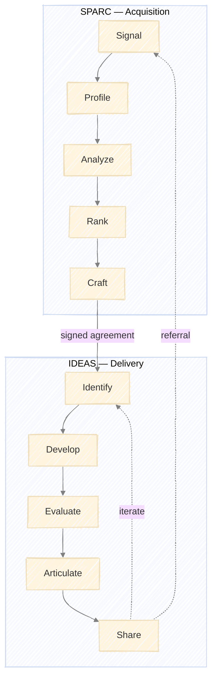

# The PRAXIS Model

A complete framework for research consulting: from finding clients to delivering value.

**PRAXIS** = Practice + Axis — the central axis around which your consulting practice operates.



---

## Overview

PRAXIS comprises two interlocking frameworks:

| Framework | Purpose | Stages | Trigger |
|-----------|---------|--------|---------|
| **SPARC** | Client acquisition | Signal → Profile → Analyze → Rank → Craft | Ongoing (pipeline building) |
| **IDEAS** | Research delivery | Identify → Develop → Evaluate → Articulate → Share | Signed agreement |

The frameworks share design principles: defined inputs/outputs per stage, explicit feedback loops, human approval gates, and quality criteria.

---

## The Complete Lifecycle

```
┌─────────────────────────────────────────────────────────────────────────────┐
│                              PRAXIS LIFECYCLE                               │
├─────────────────────────────────────────────────────────────────────────────┤
│                                                                             │
│   SPARC (Acquisition)                    IDEAS (Delivery)                   │
│   ───────────────────                    ─────────────────                  │
│                                                                             │
│   ┌─────────┐                            ┌─────────┐                        │
│   │ Signal  │ ← ─ ─ ─ ─ ─ ─ ─ ─ ─ ─ ─ ─ ─│  Share  │ (referrals)           │
│   └────┬────┘                            └────┬────┘                        │
│        ↓                                      ↑                             │
│   ┌─────────┐                            ┌─────────┐                        │
│   │ Profile │                            │Articulate│                       │
│   └────┬────┘                            └────┬────┘                        │
│        ↓                                      ↑                             │
│   ┌─────────┐                            ┌─────────┐                        │
│   │ Analyze │                            │Evaluate │                        │
│   └────┬────┘                            └────┬────┘                        │
│        ↓                                      ↑                             │
│   ┌─────────┐                            ┌─────────┐                        │
│   │  Rank   │                            │ Develop │                        │
│   └────┬────┘                            └────┬────┘                        │
│        ↓                                      ↑                             │
│   ┌─────────┐    signed agreement       ┌─────────┐                        │
│   │  Craft  │ ─────────────────────────→│Identify │                        │
│   └─────────┘                            └─────────┘                        │
│                                                                             │
└─────────────────────────────────────────────────────────────────────────────┘
```

---

## Framework Connections

### SPARC → IDEAS (Agreement Handoff)

When Craft produces a signed agreement, artifacts transfer to IDEAS:

| SPARC Output | Transfer | IDEAS Input | Action Required |
|--------------|----------|-------------|-----------------|
| Prospect Analysis Report | → | Client Analysis Report | Expand strategic context |
| Signed Agreement | → | Client Contract Agreement | Validate scope alignment |
| Outreach Brief | → | Hypothesis seeds | Check tractability |

**Handoff Checklist:**
- [ ] Analysis depth sufficient for research planning
- [ ] Contract scope matches identified opportunities
- [ ] Timeline realistic for proposed work
- [ ] Stakeholders identified for delivery

### IDEAS → SPARC (Referral Loop)

When Share completes successfully, outcomes feed back to SPARC:

| IDEAS Output | Transfer | SPARC Input | Action Required |
|--------------|----------|-------------|-----------------|
| Satisfied client | → | Referral source | Request introductions |
| Case study | → | Credibility asset | Use in outreach |
| Published work | → | Signal amplifier | Attracts inbound |
| Expanded network | → | New signals | Monitor for opportunities |

**Referral Timing:** Request at ~2/3 through engagement when value is demonstrated but relationship is active.

---

## Shared Inputs

Both frameworks depend on foundational definitions:

| Input | Description | Used By |
|-------|-------------|---------|
| Positioning Statement | Who you help, with what, your differentiation | SPARC (filtering), IDEAS (scoping) |
| Ideal Client Profile | Company characteristics indicating fit | SPARC (Signal, Rank) |
| Service Offerings | What you deliver, price points | SPARC (Craft), IDEAS (Articulate) |
| Expertise Inventory | Your skills, methods, past work | SPARC (Analyze), IDEAS (Develop) |

---

## Parallel Structure

Both frameworks follow identical structural patterns:

| Element | SPARC | IDEAS |
|---------|-------|-------|
| Stages | 5 | 5 |
| Per-stage components | Activities table, criteria, output | Same |
| Feedback loops | 6 conditions | 9 conditions |
| Quality criteria | Checklist per stage | Same |
| Human gates | Approval before handoff | Same |

---

## Operating Rhythm

### Weekly Cadence

| Day | SPARC Activity | IDEAS Activity |
|-----|----------------|----------------|
| Monday | Review Signal Log | Weekly client sync |
| Tuesday | Profile new prospects | Research execution |
| Wednesday | Deep analysis | Research execution |
| Thursday | Score and rank pipeline | Research execution |
| Friday | Craft and send outreach | Document and review |

### Time Allocation

| Activity | % of Time | Hours/Week (40h) |
|----------|-----------|------------------|
| IDEAS (Delivery) | 70-80% | 28-32 |
| SPARC (Acquisition) | 20-30% | 8-12 |

When client load is full (2 concurrent), SPARC shifts to maintenance mode (monitoring only).

---

## Pipeline States

### SPARC Pipeline

| State | Definition | Capacity Target |
|-------|------------|-----------------|
| Monitoring | In Signal Log, not yet profiled | Unlimited |
| Profiled | Company Profile complete | 10-15 |
| Analyzed | Prospect Analysis complete | 5-8 |
| Ranked | Scored, prioritized | 3-5 |
| Outreach | Message sent, awaiting response | 3-5 |
| Discovery | In conversation | 1-2 |
| Proposal | Proposal sent | 1-2 |

### IDEAS Pipeline

| State | Definition | Capacity Target |
|-------|------------|-----------------|
| Intake | Agreement signed, validating handoff | 1 |
| Active | In Identify → Articulate | 2 |
| Delivery | In Share, awaiting feedback | 1 |
| Complete | Delivered, in referral window | 2-3 |

---

## Cross-Framework Feedback Loops

Beyond stage-level loops, some conditions route between frameworks:

| Condition | From | To | Action |
|-----------|------|-----|--------|
| Client not a fit mid-engagement | IDEAS (any) | SPARC (Pass) | Document learnings, refine ICP |
| Scope expansion opportunity | IDEAS (Identify) | SPARC (Craft) | Propose amendment |
| Referral received | IDEAS (Share) | SPARC (Signal) | Fast-track to Profile |
| Market insight from research | IDEAS (Evaluate) | SPARC (Signal) | Adjust monitoring criteria |

---

## Metrics Dashboard

### Acquisition (SPARC)

| Metric | Target | Frequency |
|--------|--------|-----------|
| Signals logged | 10-20 | Weekly |
| Profiles created | 2-4 | Weekly |
| Analyses completed | 1-2 | Weekly |
| Outreach sent | 3-5 | Weekly |
| Response rate | >20% | Monthly |
| Discovery calls | 2-4 | Monthly |
| Proposals sent | 1-2 | Monthly |
| Close rate | >50% | Quarterly |

### Delivery (IDEAS)

| Metric | Target | Frequency |
|--------|--------|-----------|
| Hypotheses developed | 2-4 | Per engagement |
| Evidence sources consulted | 10+ | Per hypothesis |
| Client satisfaction | >8/10 | Per engagement |
| Deliverables on time | 100% | Per engagement |
| Referrals requested | 1 | Per engagement |
| Referrals received | >50% | Quarterly |
| Repeat engagements | >30% | Annual |

---

## Agent Architecture Integration

The PRAXIS model maps to agents and skills:

| Framework | Agents | Shared Skills |
|-----------|--------|---------------|
| SPARC | Signal, Profile, Analyze, Rank, Craft | web_search, web_fetch, gap_analysis, data_store |
| IDEAS | Identify, Develop, Evaluate, Articulate, Share | web_search, web_fetch, gap_analysis, data_store |

See `implementation/Agent_Architecture.md` for full skill catalog and orchestration patterns.

---

## Getting Started

### Phase 1: Foundation
1. Define positioning, ICP, and service offerings
2. Set up Signal monitoring sources
3. Establish data storage (Notion, Airtable, or similar)

### Phase 2: First Cycle
1. Run SPARC to first signed agreement
2. Execute IDEAS for first delivery
3. Request referral, capture learnings

### Phase 3: Steady State
1. Maintain 2 concurrent IDEAS engagements
2. Run SPARC in background (20-30% time)
3. Iterate frameworks based on experience

---

## Document Index

| Document | Purpose |
|----------|---------|
| `frameworks/PRAXIS_Model.md` | This document - overview and integration |
| `frameworks/SPARC_Framework.md` | Client acquisition methodology |
| `frameworks/IDEAS_Framework.md` | Research delivery methodology |
| `implementation/Agent_Architecture.md` | Skills, agents, and automation |
| `implementation/Examples.md` | Usage examples and worked scenarios |
