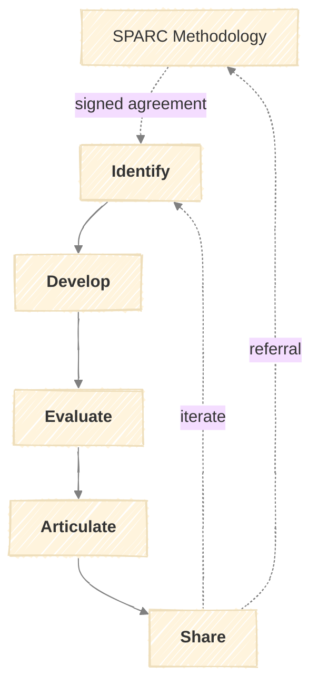

# The IDEAS Methodology

A structured research methodology for client-focused research projects.



## Inputs

IDEAS assumes the following are provided:

- **Client Contract Agreement** — Scope of work, deliverables, engagement boundaries, timeline
- **Client Analysis Report** — Deep-dive analysis identifying areas where you can provide value

---

## Stages

### Identify

Surface research opportunities from client context.

| Activity | Inputs | Outputs |
|----------|--------|---------|
| Contract Review | Client Contract Agreement | Scope constraints, deliverable requirements |
| Gap Analysis | Client Analysis Report | Gap inventory with severity ratings |
| Opportunity Mapping | Gap inventory, your expertise | Research opportunity list |
| Prioritization | Opportunities, client priorities | Prioritized research agenda |

**Key Questions:**

| Question | Purpose |
|----------|---------|
| What problems is the client trying to solve? | Align to actual needs |
| Where are gaps between current and desired state? | Find research targets |
| Which gaps align with your expertise and scope? | Filter to tractable work |
| What creates most value within timeline? | Prioritize ruthlessly |

**Output:** Research Opportunities Document — prioritized list with rationale, initial hypotheses

---

### Develop

Transform opportunities into testable hypotheses.

| Activity | Inputs | Outputs |
|----------|--------|---------|
| Prior Work Review | Research opportunity | Literature summary, known gaps |
| Hypothesis Refinement | Initial hypotheses, prior work | Formal hypothesis statements |
| Feasibility Assessment | Hypotheses, constraints | Feasibility scores, risk factors |
| Scope Definition | Feasibility assessment | Research scope document |

**Hypothesis Structure:**

```
IF [intervention/condition]
THEN [expected outcome]
BECAUSE [mechanism/rationale]
MEASURABLE BY [metric/evidence]
```

**Feasibility Criteria:**

| Criterion | Weight | Questions |
|-----------|--------|-----------|
| Data Availability | 25% | Can we access needed data? |
| Resource Requirements | 25% | Time, compute, tools available? |
| Timeline Fit | 20% | Completable within engagement? |
| Skill Match | 15% | Requires expertise we have? |
| Client Dependency | 15% | How much depends on client responsiveness? |

**Output:** Hypothesis Document — statements, required evidence, data sources, timeline, assumptions, risks

---

### Evaluate

Test claims against evidence.

| Activity | Inputs | Outputs |
|----------|--------|---------|
| Data Collection | Data sources, methods | Raw data organized by hypothesis |
| Analysis | Raw data, methods | Results, visualizations |
| Results Interpretation | Results, hypothesis criteria | Support/refute assessment |
| Problem-Fit Check | Findings, original problem | Relevance assessment |
| Quality Assurance | All outputs | QA checklist, documentation |

**Evidence Strength:**

| Type | Strength | Use For |
|------|----------|---------|
| Quantitative (metrics, benchmarks) | High | Measuring effects, comparisons |
| Qualitative (interviews, reviews) | Medium-High | Understanding mechanisms |
| Secondary research (reports) | Medium | Supporting arguments |
| Expert opinion | Low-Medium | Filling gaps |
| Anecdotal | Low | Illustration only |

**Hypothesis Verdicts:**

| Verdict | Meaning |
|---------|---------|
| Strongly Supported | Multiple evidence types converge, meaningful effect |
| Supported | Evidence favors hypothesis, some limitations |
| Inconclusive | Mixed evidence, cannot determine |
| Not Supported | Evidence contradicts hypothesis |
| Refuted | Strong evidence against |

**Output:** Evaluation Report — evidence summary, verdicts, confidence, alternatives considered, limitations

---

### Articulate

Frame findings for maximum impact.

| Activity | Inputs | Outputs |
|----------|--------|---------|
| Contribution Positioning | Evaluation results, prior work | Novelty statement |
| Audience Targeting | Stakeholders, delivery context | Format decisions |
| Recommendation Development | Findings, client constraints | Prioritized recommendations |
| Implementation Roadmap | Recommendations, timeline | Phased action plan |

**Contribution Types:**

| Type | Description |
|------|-------------|
| Novel Finding | New insight not previously documented |
| Quantified Confirmation | Evidence for suspected truth |
| Framework/Model | New way to organize thinking |
| Benchmark | Comparison point for evaluation |
| Recommendation | Actionable guidance |

**Audience Adaptation:**

| Audience | Format | Depth |
|----------|--------|-------|
| Executive | Summary + recommendations | High-level |
| Technical Lead | Technical report | Deep |
| Marketing/DevRel | Slides + talking points | Medium |
| Board/Investors | Executive brief | Minimal |

**Output:** Client Deliverable — executive summary, findings, recommendations, roadmap, appendices

---

### Share

Deliver outputs to relevant audiences.

| Activity | Inputs | Outputs |
|----------|--------|---------|
| Channel Selection | Audience, content type | Channel plan |
| Pre-delivery Review | Complete deliverable | Approval to deliver |
| Delivery Execution | Approved deliverable | Delivery confirmation |
| Feedback Collection | Delivered content | Feedback log |
| Knowledge Transfer | Findings, client team | Handoff materials |

**Delivery Channels:**

| Channel | Best For | Feedback |
|---------|----------|----------|
| Presentation (live) | Executive findings, complex topics | Real-time Q&A |
| Report (document) | Detailed findings, reference | Async comments |
| Workshop | Implementation planning, skill transfer | Interactive |
| Publication | Academic dissemination | Peer review |
| Prototype | Technical demonstration | User testing |

**Feedback Categories:**

| Category | Response |
|----------|----------|
| Clarification needed | Additional explanation |
| Scope concern | Review objectives, adjust or defer |
| Disagreement | Review evidence, consider alternatives |
| Implementation questions | Detailed guidance, follow-on engagement |
| New directions | Log for future, assess against scope |

**Output:** Delivery Confirmation + Feedback Log + Follow-up Actions

---

## Feedback Loops

| From | Condition | To |
|------|-----------|-----|
| Develop | Idea not tractable | Identify |
| Evaluate | Wrong problem | Identify |
| Evaluate | Results don't support theory | Develop |
| Articulate | Weak novelty | Identify |
| Articulate | Overclaiming results | Evaluate |
| Share | Peer review rejection | Evaluate |
| Share | Implementation issues | Develop |
| Share | Client feedback | Articulate |
| Any | Fundamental misalignment | Exit/Renegotiate |

---

## Stage Outputs Summary

| Stage | Output | Format |
|-------|--------|--------|
| Identify | Research Opportunities Document | Prioritized list |
| Develop | Hypothesis Document | Structured hypotheses |
| Evaluate | Evaluation Report | Evidence + verdicts |
| Articulate | Client Deliverable | Report/slides/prototype |
| Share | Delivery Confirmation | Log + actions |

---

## Quality Criteria

**Identify:**
- [ ] Contract deliverables mapped to opportunities
- [ ] Opportunities aligned with client priorities
- [ ] At least one clearly actionable within timeline

**Develop:**
- [ ] Hypotheses are falsifiable
- [ ] Required evidence specified
- [ ] Data sources identified and accessible
- [ ] Timeline realistic
- [ ] Assumptions stated

**Evaluate:**
- [ ] Collection methods documented
- [ ] Analysis reproducible
- [ ] Alternatives considered
- [ ] Confidence appropriate to evidence
- [ ] Problem-fit assessed

**Articulate:**
- [ ] Findings framed for audience
- [ ] Claims supported by evidence
- [ ] Recommendations actionable
- [ ] Limitations acknowledged

**Share:**
- [ ] Deliverable reviewed before distribution
- [ ] Channel appropriate for audience
- [ ] Feedback mechanism in place
- [ ] Knowledge transfer adequate

---

## SPARC → IDEAS Handoff

| SPARC Output | Becomes | IDEAS Input |
|--------------|---------|-------------|
| Prospect Analysis Report | → | Client Analysis Report |
| Signed Agreement | → | Client Contract Agreement |
| Outreach Brief | → | Initial hypothesis seeds |
