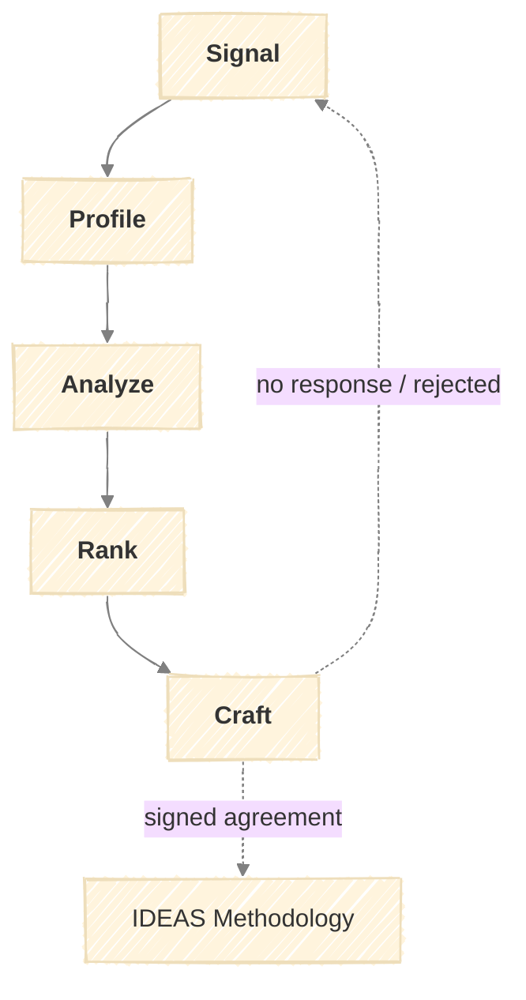

# The SPARC Methodology

A structured methodology for identifying and pitching research consulting clients.



## Inputs

SPARC assumes the following are defined:

- **Positioning Statement** — Who you help, with what problem, and your differentiation
- **Ideal Client Profile (ICP)** — Company characteristics that indicate fit
- **Service Offerings** — What you deliver, at what price points

---

## Stages

### Signal

Detect companies exhibiting buying signals.

| Activity | Inputs | Outputs |
|----------|--------|---------|
| Source Monitoring | Source config, keywords | Raw signal stream |
| Signal Scoring | Raw signals, strength criteria | Scored Signal Log |

**Sources:**

| Source | Signal Type |
|--------|-------------|
| Crunchbase / PitchBook | Funding rounds (Series B+) |
| LinkedIn | Leadership posts, hiring activity |
| Job Boards | DevRel, AI/ML, technical writer roles |
| News / Alerts | Product launches, partnerships, pivots |
| GitHub / HuggingFace | Technical activity, open-source investment |

**Signal Strength:**

| Tier | Criteria | Action |
|------|----------|--------|
| Hot | Funding + AI hiring + public gap acknowledgment | Immediate Profile |
| Warm | Funding OR AI hiring + relevant vertical | Profile within 1 week |
| Watch | Single weak signal | Add to monitoring list |

**Output:** Signal Log — timestamped records with company, signal type, source, link, score

---

### Profile

Build structured company profiles from public data.

| Activity | Inputs | Outputs |
|----------|--------|---------|
| Data Collection | Company identifiers, source list | Raw data by category |
| Profile Synthesis | Raw data, template | Company Profile |

**Data Categories:**

| Category | Fields |
|----------|--------|
| Firmographics | Name, HQ, employees, funding history |
| Market Position | Vertical, competitors, differentiation |
| Technical Footprint | Stack, open-source presence, docs quality |
| Key People | Decision-makers, backgrounds |
| Recent Activity | Last 90 days: announcements, hires, launches |

**Output:** Company Profile (1-2 pages) — structured document with above fields

---

### Analyze

Conduct deep research on strategic gaps and opportunities.

| Activity | Inputs | Outputs |
|----------|--------|---------|
| Competitive Analysis | Company profile, competitor profiles | Gap matrix, positioning map |
| Content/DevEx Audit | Documentation, community presence | Gap assessment |
| Strategic Priority Mapping | Public statements, hiring, investments | Priority list |
| Entry Point Identification | Key people, org structure | Buyer profile, budget estimate |

**Analysis Dimensions:**

| Dimension | Questions |
|-----------|-----------|
| Competitive Position | Where are competitors outperforming? What do customers say? |
| Content Gaps | Documentation depth? Community maturity? |
| Strategic Priorities | What are they publicly investing in? |
| Entry Points | Who is the buyer? What makes them look good? |

**Output:** Prospect Analysis Report (3-5 pages) — gaps, opportunities, engagement rationale

---

### Rank

Score prospects against qualification criteria.

| Activity | Inputs | Outputs |
|----------|--------|---------|
| Criteria Scoring | Prospect Analysis, scorecard | Score breakdown |
| Pipeline Positioning | Score, current pipeline | Priority recommendation |

**Qualification Scorecard:**

| Criterion | Weight | 1 (Poor) | 3 (Moderate) | 5 (Strong) |
|-----------|--------|----------|--------------|------------|
| Budget Indicators | 25% | Pre-seed, <20 emp | Series A, 50-200 emp | Series B+, >200 emp |
| Problem Fit | 25% | Tangential | Adjacent | Direct match |
| Timing | 20% | No urgency | General interest | Active signals |
| Access | 15% | No path | Mutual connections | Direct/warm intro |
| Strategic Value | 15% | One-off | Ongoing potential | Ongoing + referrals |

**Thresholds:**

| Score | Action |
|-------|--------|
| 4.0+ | Prioritize — active outreach |
| 3.0–3.9 | Qualified — outreach when capacity allows |
| 2.0–2.9 | Nurture — monitor, engage with content |
| <2.0 | Pass |

**Output:** Ranked Prospect List — scored, sorted by priority

---

### Craft

Develop tailored outreach based on analysis.

| Activity | Inputs | Outputs |
|----------|--------|---------|
| Message Drafting | Prospect Analysis, templates, buyer profile | Outreach variants |
| Brief Preparation | Analysis, likely questions | Supporting Brief |

**Outreach Structure:**

| Component | Purpose |
|-----------|---------|
| Hook | Reference specific signal or content |
| Insight | Non-obvious observation from research |
| Bridge | Connect their gap to your capability |
| Ask | Specific, low-commitment next step |

**Channels (preference order):** Warm intro → Content engagement then DM → Cold DM → Email

**Output:** Outreach Message + Supporting Brief (talking points for response)

---

## Feedback Loops

| From | Condition | To |
|------|-----------|-----|
| Profile | Insufficient public data | Signal (monitor for more) |
| Analyze | Problem doesn't match positioning | Pass or Nurture |
| Rank | Score below threshold | Nurture or Pass |
| Craft | No response after 2 touches | Nurture |
| Craft | Response but no fit | Pass or refer out |
| Craft | Response + fit | Discovery → Proposal → IDEAS |

For cross-framework feedback loops (e.g., scope expansion routing back to Craft, referrals routing from IDEAS), see [PRAXIS.md](../framework/PRAXIS.md#cross-framework-feedback-loops).

---

## Nurture and Pass States

### Pass

Prospects scored <2.0 or identified as not a fit exit the active pipeline.

**Pass Actions:**
- Document reason for exclusion
- Capture learnings (refine ICP, positioning)
- No further outreach unless they re-signal

**Pass Record:**
```yaml
company: [Name]
passed_date: YYYY-MM-DD
stage_exited: [analyze | rank | craft]
reason: [Not in ICP | No budget indicators | Problem mismatch | Rejected outreach]
learnings: [Optional insight for ICP refinement]
```

### Nurture

Prospects scored 2.0–2.9 or with timing issues enter a monitoring state.

**Nurture Actions:**
- Add to watch list for re-engagement triggers
- Continue content engagement (not direct outreach)
- Periodic check-in review (quarterly)

**Nurture Record:**
```yaml
company: [Name]
entered_nurture: YYYY-MM-DD
reason: [Timing not right | Budget uncertain | Access blocked | Partial fit]
re-engagement_triggers:
  - [Trigger 1: e.g., "New funding round"]
  - [Trigger 2: e.g., "DevRel hiring resumes"]
check_in: YYYY-MM-DD  # Quarterly review
```

**Re-engagement:**

When a nurture trigger fires:
1. Create new Signal entry with "Nurture re-engagement" source
2. Re-run Profile (update stale data)
3. Re-score through Rank
4. If score improves to 3.0+, proceed to Craft

See [Examples.md](../implementation/Examples.md#feedback-loop-example) for a worked example.

---

## Stage Outputs Summary

| Stage | Output | Format |
|-------|--------|--------|
| Signal | Signal Log | Structured records |
| Profile | Company Profile | 1-2 page document |
| Analyze | Prospect Analysis Report | 3-5 page document |
| Rank | Ranked Prospect List | Scored list |
| Craft | Outreach Message + Brief | Message + notes |

---

## Quality Criteria

**Signal:**
- [ ] Sources monitored on defined schedule
- [ ] Signals scored consistently against criteria
- [ ] Hot signals actioned within 48 hours

**Profile:**
- [ ] All data categories populated or marked unavailable
- [ ] Key decision-makers identified
- [ ] Recent activity captured (last 90 days)

**Analyze:**
- [ ] Competitive comparison completed
- [ ] Gaps tied to your positioning
- [ ] Entry point and budget range estimated

**Rank:**
- [ ] All criteria scored with rationale
- [ ] Score reflects current pipeline capacity
- [ ] Threshold action followed

**Craft:**
- [ ] Hook references specific, recent signal
- [ ] Insight demonstrates research depth
- [ ] Ask is concrete and low-friction
- [ ] Brief prepared for likely responses

---

## SPARC → IDEAS Handoff

When Craft produces a signed agreement, artifacts transfer to IDEAS for research delivery. Key transfers:
- Prospect Analysis Report → Client Analysis Report
- Signed Agreement → Client Contract Agreement
- Outreach Brief → Initial hypothesis seeds

See [PRAXIS.md](../framework/PRAXIS.md#sparc--ideas-agreement-handoff) for the complete handoff checklist.
