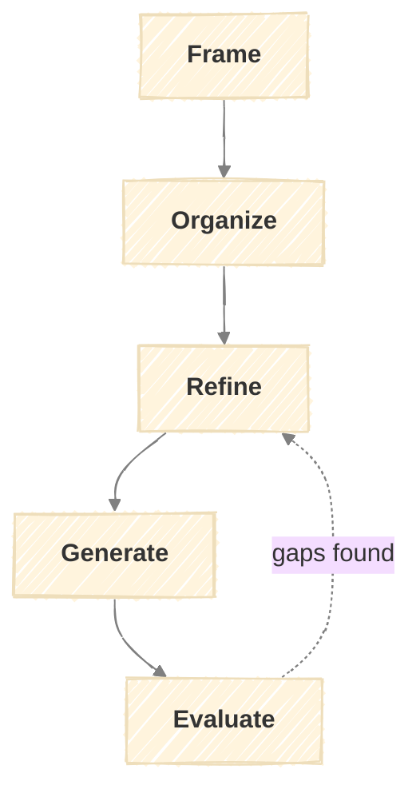

# Framework Generator

A meta-model for creating structured, repeatable frameworks.



## Purpose

Create new frameworks by guiding you through a structured design process. Use it when:

- You need a repeatable workflow for a domain
- An existing framework needs to be restructured
- You're building frameworks for others to use

**Output:** A complete framework (documentation + executable skill files) ready for use.

---

## Inputs

| Input | Required | Description |
|-------|----------|-------------|
| Problem description | Yes | What workflow or process needs systematizing |
| Context | Yes | Domain, constraints, who will use it |
| Reference frameworks | Recommended | Existing frameworks to draw patterns from |

---

## Outputs

All artifacts are saved to `output/{date}/{name}/` where `{date}` is the run start date (YYYY-MM-DD).

| Artifact | Path | Created At |
|----------|------|------------|
| Run log | `run.md` | Frame (updated each stage) |
| Framework charter | `1-frame/charter.md` | Frame |
| Stage map | `2-organize/stage-map.md` | Organize |
| Stage specs | `3-refine/{stage}-spec.md` | Refine |
| Generated framework | `4-generate/` | Generate |
| Validation report | `5-evaluate/validation.md` | Evaluate |

### Run Log

Tracks progress and decisions made at each stage. See `docs/execution.md` for full format.

```markdown
# Framework Run: {Name}

Started: {date}
Status: in_progress / complete / aborted

## Progress

| # | Stage | Status | Started | Completed |
|---|-------|--------|---------|-----------|
| 1 | Frame | ✓ complete | {time} | {time} |
| 2 | Organize | → in_progress | {time} | - |
| 3 | Refine | ○ pending | - | - |
| 4 | Generate | ○ pending | - | - |
| 5 | Evaluate | ○ pending | - | - |

---

## 1. Frame - {date}
...

## Outcome

**Status:** complete / aborted
**Result:** {name} framework created with {n} stages
**Location:** `4-generate/`
```

---

## Stages

### Frame

Define purpose and boundaries.

| Activity | Inputs | Outputs |
|----------|--------|---------|
| Problem Definition | Problem description | Problem statement |
| Purpose Articulation | Problem statement, context | Purpose statement |
| Boundary Setting | Purpose, context | Scope (in/out) |
| Trigger Identification | Purpose, usage patterns | Trigger conditions |
| Type Determination | Purpose, flow needs | Framework type |

**Framework Types:**

| Type | Characteristics |
|------|-----------------|
| Foundation | Single assessment, run once, feeds other frameworks |
| Pipeline | Sequential stages, ongoing execution, feedback loops |
| Cyclical | Repeating execution on a cadence |
| Hub | Central stage that others connect to |

**Output:** Framework Charter

```markdown
# Framework Charter: [NAME]

## Problem
[What workflow/process does this address?]

## Purpose
[Why does this framework need to exist?]

## Scope
**In:** [What's covered]
**Out:** [What's excluded]

## Triggers
[When should this framework be run?]

## Type
[Foundation / Pipeline / Cyclical / Hub]

## Dependencies
[Other frameworks this requires as input, if any]
```

---

### Organize

Map stages and flow.

| Activity | Inputs | Outputs |
|----------|--------|---------|
| Stage Identification | Framework charter | Stage list with purposes |
| Flow Mapping | Stage list, type | Flow diagram |
| Dependency Mapping | Charter, other frameworks | Integration points |
| Loop Definition | Flow, failure modes | Feedback loops table |
| Terminal States | Flow, outcomes | Exit conditions |

**Output:** Stage Map

```markdown
# Stage Map: [NAME]

## Stages
| Stage | Purpose | Inputs | Outputs |
|-------|---------|--------|---------|
| [Name] | [What it does] | [What it needs] | [What it produces] |

## Flow
[Mermaid diagram]

## Dependencies
| This Framework Needs | From |
|----------------------|------|
| [Input] | [Source] |

## Feedback Loops
| From | Condition | To |
|------|-----------|-----|
| [Stage] | [When this happens] | [Go here] |

## Terminal States
| State | Definition | Actions |
|-------|------------|---------|
| [Name] | [When reached] | [What to do] |
```

---

### Refine

Specify each stage in detail.

| Activity | Inputs | Outputs |
|----------|--------|---------|
| Activity Definition | Stage map | Activities table per stage |
| Context Tables | Domain knowledge | Supporting reference tables |
| Output Templating | Stage outputs | Output format per stage |
| Criteria Definition | Quality standards | Checklist per stage |

**Stage Specification Structure:**

| Component | Purpose |
|-----------|---------|
| Activities table | What happens, with inputs/outputs |
| Context tables | Reference information (criteria, categories, etc.) |
| Output format | Template or structure for stage output |
| Quality criteria | Checklist for completion |

**Output:** Stage Specifications (one per stage)

```markdown
# Stage Specification: [STAGE NAME]

## Activities
| Activity | Inputs | Outputs |
|----------|--------|---------|
| [Action] | [What it needs] | [What it produces] |

## [Context Table Name]
| [Column] | [Column] |
|----------|----------|
| [Data] | [Data] |

## Output Format
[Template block showing expected output structure]

## Quality Criteria
- [ ] [Criterion 1]
- [ ] [Criterion 2]
```

---

### Generate

Produce a self-contained framework package.

| Activity | Inputs | Outputs |
|----------|--------|---------|
| Framework Document | Charter, stage map, specifications | `4-generate/docs/{name}.md` |
| Execution Guide | Stage map, specifications | `4-generate/docs/execution.md` |
| Skill Files | Specifications | `4-generate/.claude/skills/{stage}/SKILL.md` |
| README | Charter, stage map | `4-generate/README.md` |
| CLAUDE.md | All artifacts | `4-generate/CLAUDE.md` |

**Generated Framework Structure:**

```
4-generate/
├── README.md                      # Framework overview and usage
├── CLAUDE.md                      # AI assistant instructions
├── docs/
│   ├── {name}.md                  # Framework definition
│   └── execution.md               # How to run stages
└── .claude/skills/
    ├── {stage-1}/SKILL.md
    └── {stage-2}/SKILL.md
```

**Skill File Structure:**

```markdown
---
name: {stage-name}
description: {One-line description for skill picker}
---

# {Stage Name}

{Brief purpose statement}

## Inputs
| Input | Source |
|-------|--------|
| {input} | {where it comes from} |

### Input Format

**From {source} (`{path}`):**

```markdown
{Expected structure}
```

## Process
**1. {Step}** - {Description}
**2. {Step}** - {Description}

## Output

Save to `output/{date}/{framework-name}/{#}-{stage}/`.

| File | Content |
|------|---------|
| `{output-file}.md` | {Description} |

### {Output File} ({filename}.md)

```markdown
{Template with placeholders}
```

## Quality Criteria
- [ ] {Criterion}

## Completion
{What to present, next action}
```

---

### Evaluate

Validate and iterate.

| Activity | Inputs | Outputs |
|----------|--------|---------|
| Convention Check | Generated files, patterns | Compliance report |
| Completeness Audit | Files, specification | Gap list |
| Dry Run | First stage skill | Execution notes |
| Refinement | Gaps, notes | Updated specifications |

**Convention Checklist:**

- [ ] Framework document follows structure (purpose, inputs, stages, loops, criteria)
- [ ] Each stage has activities table with inputs/outputs
- [ ] Quality criteria are actionable checklists
- [ ] Feedback loops have clear conditions
- [ ] Skills have frontmatter (name, description)
- [ ] Skills have input format section after inputs table
- [ ] Skills follow inputs → input format → process → output → criteria → completion structure
- [ ] Output templates embedded in skill Output section
- [ ] Mermaid diagrams render correctly

**Output:** Validation Report

```markdown
# Validation Report: [NAME]

## Convention Compliance
- [x] / [ ] {Each checklist item}

## Gaps Found
| Location | Issue | Resolution |
|----------|-------|------------|
| {File/section} | {Problem} | {Fix needed} |

## Dry Run Notes
{Observations from attempting first stage}

## Status
[Ready / Needs refinement]
```

---

## Feedback Loops

| From | Condition | To |
|------|-----------|-----|
| Organize | Stages don't cover the problem | Frame (refine scope) |
| Refine | Stage purpose unclear | Organize (clarify stage) |
| Evaluate | Gaps in specifications | Refine |
| Evaluate | Structural issues | Organize |
| Evaluate | Scope creep detected | Frame |

---

## Quality Criteria

**Frame:**
- [ ] Problem is specific, not generic
- [ ] Purpose explains why this framework vs. ad-hoc process
- [ ] Scope boundaries are clear
- [ ] Framework type matches the workflow pattern

**Organize:**
- [ ] Stages are distinct (no overlap)
- [ ] Flow is logical (outputs feed inputs)
- [ ] Dependencies on other frameworks identified
- [ ] Feedback loops cover failure modes

**Refine:**
- [ ] Every stage has activities with clear I/O
- [ ] Output formats are specific templates, not vague descriptions
- [ ] Quality criteria are checkboxes, not prose

**Generate:**
- [ ] All files follow conventions
- [ ] Skills are executable (not just documentation)
- [ ] Documentation updated

**Evaluate:**
- [ ] Dry run attempted
- [ ] All convention checks passed
- [ ] Gaps resolved or documented

---

## Stage Outputs Summary

| Stage | Output | Format |
|-------|--------|--------|
| Frame | Framework Charter | Structured markdown |
| Organize | Stage Map | Markdown + mermaid diagram |
| Refine | Stage Specifications | Markdown per stage |
| Generate | Framework + Skills | File set |
| Evaluate | Validation Report | Markdown |
