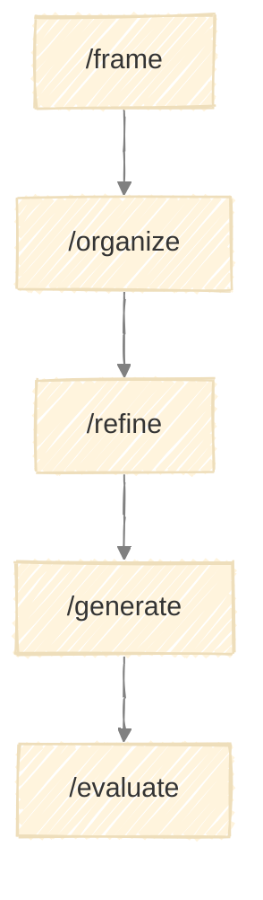

# Framework Generator

A tool for creating structured, repeatable frameworks with executable skills.



---

## What It Does

The Framework Generator helps you create new frameworks by guiding you through five stages:

| Stage | Purpose | Output |
|-------|---------|--------|
| Frame | Define purpose and boundaries | Framework charter |
| Organize | Map stages and flow | Stage map with diagram |
| Refine | Specify each stage in detail | Stage specifications |
| Generate | Produce documentation and skills | Framework files |
| Evaluate | Validate and iterate | Validation report |

Each stage produces artifacts that feed the next. The final output is a complete framework with documentation and executable skill files.

---

## When to Use It

Use the Framework Generator when you need:

- A repeatable process for a domain
- Structured workflows with quality gates
- Executable skills that guide users through stages
- Documentation that stays in sync with execution

---

## Execution

Run stages via skill commands:

```
/frame → /organize → /refine → /generate → /evaluate
```

Each stage requires approval before proceeding. See [execution.md](execution.md) for details.

---

## Output Structure

```
output/
└── {date}/{name}/
    ├── run.md                        # Progress tracking + decisions
    │
    ├── 1-frame/
    │   └── charter.md
    ├── 2-organize/
    │   └── stage-map.md
    ├── 3-refine/
    │   └── {stage}-spec.md           # One per stage
    ├── 4-generate/                   # ← Portable framework
    │   ├── README.md
    │   ├── CLAUDE.md
    │   ├── docs/
    │   │   ├── {name}.md
    │   │   └── execution.md
    │   └── .claude/skills/
    │       └── {stage}/SKILL.md
    └── 5-evaluate/
        └── validation.md
```

The `4-generate/` folder contains a self-sufficient framework that can be copied to any project.

---

## Document Index

| Document | Purpose |
|----------|---------|
| `docs/overview.md` | This document |
| `docs/model.md` | Framework Generator model |
| `docs/execution.md` | How to run stages |
| `CLAUDE.md` | Project instructions |
